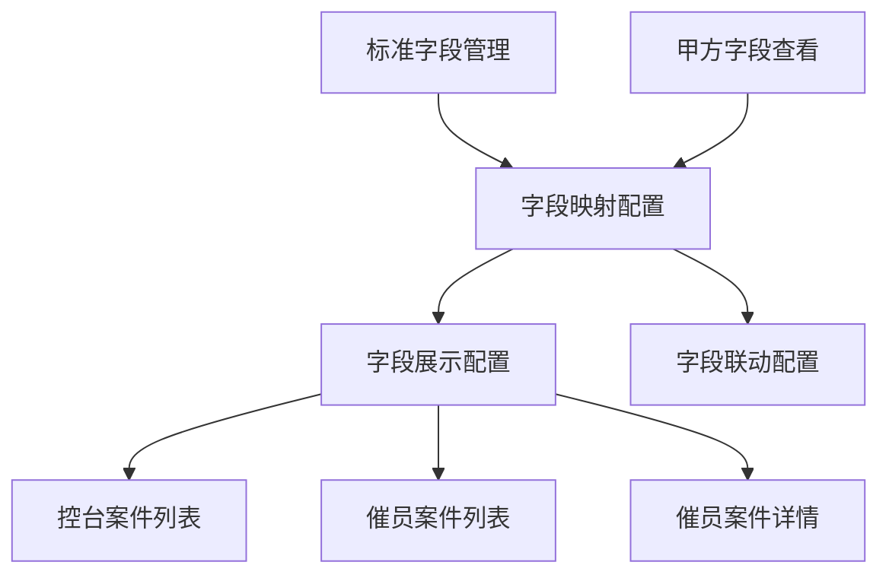
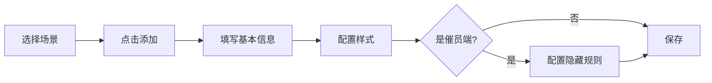
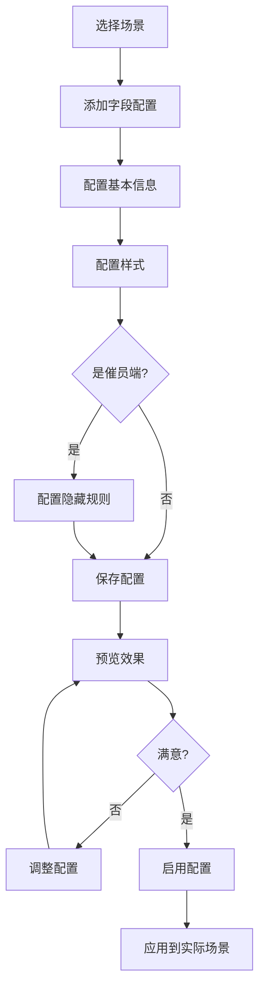
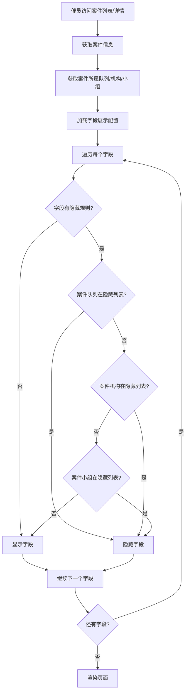

# CCO系统 - 字段配置功能 PRD

## 文档信息

| 项目 | 内容 |
|------|------|
| 文档名称 | CCO系统字段配置功能产品需求文档 |
| 版本号 | V2.0 |
| 创建日期 | 2025-11-19 |
| 最后更新 | 2025-11-20 |
| 产品经理 | - |
| 开发团队 | CCO开发团队 |

## 目录

1. [需求概述](#需求概述)
2. [功能架构](#功能架构)
3. [详细功能设计](#详细功能设计)
4. [数据模型](#数据模型)
5. [接口设计](#接口设计)
6. [用户界面设计](#用户界面设计)
7. [业务流程](#业务流程)
8. [非功能性需求](#非功能性需求)
9. [实施计划](#实施计划)

---

## 需求概述

### 1.1 背景

CCO（Collection Operation）系统是一个SaaS催收管理平台，需要为不同甲方提供灵活的字段配置能力。系统需要支持标准字段管理、甲方字段映射、以及不同场景下的字段展示配置。

### 1.2 目标

1. **标准化管理**：建立统一的标准字段库，确保数据规范性
2. **灵活映射**：支持甲方字段与标准字段的灵活映射关系
3. **个性化展示**：支持不同场景下字段展示的个性化配置
4. **权限控制**：支持基于队列、机构、小组的字段隐藏规则

### 1.3 用户角色

| 角色 | 职责 | 权限 |
|------|------|------|
| 系统管理员 | 管理标准字段、字段分组 | 完全权限 |
| 甲方管理员 | 配置甲方字段映射、展示规则 | 甲方范围内完全权限 |
| 机构管理员 | 查看和使用字段配置 | 只读权限 |
| 催员 | 使用配置好的字段展示 | 只读权限 |

---

## 功能架构

### 2.1 功能模块

```
字段配置系统
├── 标准字段管理
│   ├── 字段定义
│   ├── 字段分组
│   ├── 字段验证规则
│   └── 枚举值管理
├── 甲方字段查看
│   ├── 字段JSON展示
│   ├── 字段分组查看
│   └── 字段版本管理
├── 字段映射配置
│   ├── 标准字段映射
│   ├── 自定义字段创建
│   ├── 未映射字段处理
│   └── 扩展字段管理
├── 字段联动配置
│   ├── 联动规则定义
│   ├── 条件表达式
│   └── 联动动作
└── 甲方字段展示配置 ⭐ 新增
    ├── 控台案件列表配置
    ├── 催员案件列表配置
    ├── 催员案件详情配置
    └── 字段样式配置
```

### 2.2 模块关系图



---

## 详细功能设计

### 3.1 标准字段管理

#### 3.1.1 功能描述

标准字段是CCO系统的核心字段库，所有甲方的字段最终都需要映射到标准字段。标准字段由系统管理员统一管理。

#### 3.1.2 核心功能

**1. 字段定义**

| 字段属性 | 说明 | 必填 | 示例 |
|---------|------|------|------|
| 字段名称 | 中文显示名称 | 是 | 案件编号 |
| 字段标识 | 英文唯一标识 | 是 | case_number |
| 字段类型 | 数据类型 | 是 | String/Integer/Date/Enum等 |
| 所属分组 | 字段分组 | 是 | 基本信息/客户信息等 |
| 是否必填 | 必填标识 | 是 | 是/否 |
| 验证规则 | 数据验证规则 | 否 | 正则表达式、范围等 |
| 示例值 | 示例数据 | 否 | CASE20250119001 |
| 描述说明 | 字段说明 | 否 | 唯一标识案件的编号 |

**2. 字段类型**

| 类型 | 说明 | 示例 |
|------|------|------|
| String | 文本类型 | 姓名、地址 |
| Integer | 整数类型 | 年龄、数量 |
| Decimal | 小数类型 | 金额、利率 |
| Date | 日期类型 | 生日、到期日 |
| Datetime | 日期时间类型 | 创建时间、更新时间 |
| Boolean | 布尔类型 | 是否逾期 |
| Enum | 枚举类型 | 状态、类型 |

**3. 枚举值管理**

对于枚举类型字段，需要配置枚举值：

| 属性 | 说明 | 示例 |
|------|------|------|
| 标准名称 | 系统内部使用的名称 | OVERDUE |
| 标准ID | 系统内部使用的ID | 1 |
| 甲方名称 | 甲方系统使用的名称 | 已逾期 |
| 甲方ID | 甲方系统使用的ID | overdue |

#### 3.1.3 操作流程

1. **添加标准字段**
   - 点击"添加字段"按钮
   - 填写字段信息
   - 选择字段类型
   - 如果是枚举类型，配置枚举值
   - 保存

2. **编辑标准字段**
   - 点击字段行的"编辑"按钮
   - 修改字段信息
   - 保存

3. **删除标准字段**
   - 点击字段行的"删除"按钮
   - 确认删除（检查是否有甲方在使用）
   - 删除成功

4. **字段排序**
   - 拖拽字段行进行排序
   - 自动保存排序结果

---

### 3.2 甲方字段查看

#### 3.2.1 功能描述

展示甲方通过API接口传入的字段JSON数据，供系统管理员和甲方管理员查看和参考。

#### 3.2.2 核心功能

**1. 字段列表展示**

| 展示项 | 说明 |
|--------|------|
| 字段名称 | 甲方系统中的字段名称 |
| 字段标识 | 甲方系统中的字段标识 |
| 字段类型 | 字段数据类型 |
| 枚举值 | 如果是枚举类型，显示枚举值 |
| 是否必填 | 必填标识 |
| 排序 | 字段排序顺序 |

**2. 字段分组查看**

- 左侧显示字段分组树
- 点击分组查看该分组下的字段
- 支持多级分组

**3. 版本信息**

- 显示最新JSON的获取时间
- 标识字段数据的版本

#### 3.2.3 数据来源

甲方通过API接口推送字段JSON数据：

```json
{
  "fetched_at": "2025-11-19T10:00:00Z",
  "fields": [
    {
      "field_name": "案件编号",
      "field_key": "case_number",
      "field_type": "String",
      "field_group_id": 1,
      "is_required": true,
      "sort_order": 1
    },
    {
      "field_name": "案件状态",
      "field_key": "case_status",
      "field_type": "Enum",
      "field_group_id": 1,
      "is_required": true,
      "enum_values": [
        {"name": "待分配", "value": "pending"},
        {"name": "催收中", "value": "collecting"},
        {"name": "已完结", "value": "closed"}
      ],
      "sort_order": 2
    }
  ]
}
```

---

### 3.3 字段映射配置

#### 3.3.1 功能描述

将甲方字段映射到标准字段，或创建自定义字段。确保所有甲方字段都有明确的映射关系。

#### 3.3.2 核心功能

**1. 匹配目标字段**

已映射到标准字段的字段列表：

| 展示项 | 说明 |
|--------|------|
| 字段来源 | 标准字段/自定义字段 |
| 字段名称 | 标准字段名称 |
| 字段标识 | 标准字段标识 |
| 甲方字段标识 | 甲方系统中的字段标识 |
| 甲方字段ID | 甲方系统中的字段ID |
| 字段类型 | 字段数据类型 |
| 是否必填 | 必填标识 |
| 操作 | 编辑、删除 |

**2. 未使用的甲方字段**

甲方字段中尚未映射的字段：

- 显示警告提示
- 列出所有未映射字段
- 提供快速映射功能
- 支持批量处理

**3. 扩展字段**

标准字段的扩展字段：

- 基于标准字段创建扩展字段
- 扩展字段有独立的别名
- 继承标准字段的基本属性
- 可以有不同的隐私标签

#### 3.3.3 映射规则

**映射类型**

| 类型 | 说明 | 示例 |
|------|------|------|
| 标准映射 | 映射到标准字段 | 甲方的"案件号" → 标准字段"案件编号" |
| 自定义映射 | 创建自定义字段 | 甲方的"特殊标记" → 自定义字段"special_mark" |
| 扩展映射 | 创建扩展字段 | 标准字段"客户姓名" → 扩展字段"company_name" |

**枚举值映射**

对于枚举类型字段，需要映射枚举值：

```
甲方枚举值 → 标准枚举值
"待分配" → "PENDING"
"催收中" → "COLLECTING"
"已完结" → "CLOSED"
```

---

### 3.4 甲方字段展示配置 ⭐ 核心新增功能

#### 3.4.1 功能描述

配置不同场景下字段的展示方式，包括：
- 控台案件管理列表
- 催员案件列表
- 催员案件详情

每个场景可以独立配置字段的显示、排序、颜色、隐藏规则等。

#### 3.4.2 应用场景

**场景1：控台案件管理列表**

- **使用者**：系统管理员、甲方管理员、机构管理员
- **用途**：查看和管理所有案件
- **特点**：
  - 显示全面的案件信息
  - 支持多字段排序和筛选
  - 支持批量操作

**场景2：催员案件列表**

- **使用者**：催员
- **用途**：查看分配给自己的案件
- **特点**：
  - 显示催收相关的关键信息
  - 支持快速筛选和查找
  - 根据队列、机构、小组隐藏部分字段
  - 支持颜色标记（优先级、状态等）

**场景3：催员案件详情**

- **使用者**：催员
- **用途**：查看单个案件的详细信息
- **特点**：
  - 显示完整的案件信息
  - 分组展示，结构清晰
  - 根据队列、机构、小组隐藏敏感字段
  - 支持字段颜色标记

#### 3.4.3 配置项详解

**1. 基本配置**

| 配置项 | 说明 | 必填 | 示例 |
|--------|------|------|------|
| 场景类型 | 应用场景 | 是 | admin_case_list |
| 字段标识 | 字段唯一标识 | 是 | case_number |
| 字段名称 | 字段显示名称 | 是 | 案件编号 |
| 字段数据类型 | 字段的数据类型 | 是 | String/Integer/Enum等 |
| 字段来源 | 字段来源类型 | 是 | standard/extended/custom |
| 排序顺序 | 字段显示顺序 | 是 | 1 |
| 显示宽度 | 列宽度（像素），0表示自动 | 否 | 150 |

**2. 样式配置**

| 配置项 | 说明 | 可选值 | 示例 |
|--------|------|--------|------|
| 颜色类型 | 字段颜色 | normal/red/yellow/green | red |
| 颜色规则 | 动态颜色规则 | 条件表达式 | 逾期天数>30显示红色 |
| 格式化规则 | 数据格式化 | 格式类型+模式 | 货币格式，保留2位小数 |

**3. 搜索筛选配置** ⭐ 新增

| 配置项 | 说明 | 适用字段类型 | 示例 |
|--------|------|------------|------|
| 是否可搜索 | 支持关键字搜索 | String/Text | 客户姓名支持搜索 |
| 是否可筛选 | 支持下拉筛选 | Enum | 案件状态支持筛选 |
| 是否支持范围检索 | 支持范围筛选 | Integer/Decimal/Date/Datetime | 逾期天数支持范围筛选 |

**智能显示规则**：
- **可搜索开关**：仅在String/Text类型时显示
- **可筛选开关**：仅在Enum类型时显示
- **范围检索开关**：仅在Integer/Decimal/Date/Datetime类型时显示
- 不支持的功能开关自动隐藏，显示"-"占位符

**4. 颜色配置详解**

**静态颜色**

直接设置字段的颜色类型：

| 颜色 | 使用场景 | 示例 |
|------|---------|------|
| normal | 普通字段 | 客户姓名、联系电话 |
| red | 警告、紧急 | 逾期天数、欠款金额 |
| yellow | 提醒、注意 | 承诺还款日期 |
| green | 正常、完成 | 已还款金额、完结状态 |

**动态颜色规则**

根据字段值动态设置颜色：

```json
{
  "color_rule": [
    {
      "condition": "value > 30",
      "color": "red"
    },
    {
      "condition": "value > 15 && value <= 30",
      "color": "yellow"
    },
    {
      "condition": "value <= 15",
      "color": "green"
    }
  ]
}
```

示例：逾期天数字段
- 逾期>30天：红色
- 逾期15-30天：黄色
- 逾期≤15天：绿色

**5. 隐藏规则配置（仅催员端）**

**规则类型**

| 规则类型 | 说明 | 示例 |
|---------|------|------|
| 队列规则 | 基于案件所属队列 | 对"高风险队列"隐藏"身份证号" |
| 机构规则 | 基于案件所属机构 | 对"外包机构"隐藏"客户收入" |
| 小组规则 | 基于案件所属小组 | 对"新手小组"隐藏"历史欠款" |

**配置示例**

```json
{
  "hide_for_queues": ["queue_001", "queue_002"],
  "hide_for_agencies": ["agency_003"],
  "hide_for_teams": ["team_005", "team_006"]
}
```

**隐藏逻辑**

- 如果案件所属队列在`hide_for_queues`中，则隐藏该字段
- 如果案件所属机构在`hide_for_agencies`中，则隐藏该字段
- 如果案件所属小组在`hide_for_teams`中，则隐藏该字段
- 多个规则之间是"或"的关系（满足任一条件即隐藏）

**6. 格式化规则**

| 格式类型 | 说明 | 示例 |
|---------|------|------|
| date | 日期格式 | YYYY-MM-DD |
| number | 数字格式 | 千分位分隔 |
| currency | 货币格式 | ¥1,234.56 |
| percent | 百分比格式 | 85.5% |
| custom | 自定义格式 | 前缀+值+后缀 |

**格式化示例**

```json
{
  "format_rule": {
    "format_type": "currency",
    "format_pattern": "#,##0.00",
    "prefix": "¥",
    "suffix": ""
  }
}
```

#### 3.4.4 字段类型与功能对应关系 ⭐ 新增

| 字段类型 | 可搜索 | 可筛选 | 范围检索 | 说明 |
|---------|-------|-------|---------|------|
| **String** | ✅ | - | - | 支持关键字搜索 |
| **Text** | ✅ | - | - | 支持关键字搜索 |
| **Integer** | - | - | ✅ | 支持最小-最大值范围筛选 |
| **Decimal** | - | - | ✅ | 支持最小-最大值范围筛选 |
| **Date** | - | - | ✅ | 支持开始-结束日期范围筛选 |
| **Datetime** | - | - | ✅ | 支持开始-结束时间范围筛选 |
| **Enum** | - | ✅ | - | 支持下拉选择筛选 |
| **Boolean** | - | - | - | 不支持搜索筛选 |
| **JSON** | - | - | - | 不支持搜索筛选 |

**自动设置规则**：

当从可用字段列表选择字段时，系统会根据字段类型自动设置：
- String/Text类型：自动开启"可搜索"
- Enum类型：自动开启"可筛选"
- Integer/Decimal/Date/Datetime类型：自动开启"范围检索"

**范围检索功能说明**：

1. **数字类型范围检索**
   - 适用字段：Integer、Decimal
   - 界面展示：最小值 [____] - 最大值 [____]
   - 使用示例：
     - 逾期天数：0-30天
     - 贷款金额：1000-5000元
     - 联系次数：1-5次

2. **时间类型范围检索**
   - 适用字段：Date、Datetime
   - 界面展示：
     - Date: 开始日期 [____] - 结束日期 [____]
     - Datetime: 开始时间 [____] - 结束时间 [____]
   - 使用示例：
     - 应还日期：2025-01-01 到 2025-01-31
     - 分配时间：2025-01-01 00:00 到 2025-01-31 23:59

#### 3.4.5 操作流程

**1. 添加字段配置**



**2. 批量配置**

- 选择场景
- 批量导入字段
- 统一设置默认值
- 逐个调整
- 批量保存

**3. 复制场景配置**

- 选择源场景
- 选择目标场景
- 确认复制
- 系统自动复制所有配置
- 可以在目标场景中调整

**4. 快速调整**

在列表中直接调整：
- 切换"是否显示"开关
- 调整排序数字
- 切换"是否启用"开关
- 自动保存

---

### 3.5 字段联动配置

#### 3.5.1 功能描述

配置字段之间的联动关系，当某个字段的值变化时，自动触发其他字段的变化或显示/隐藏。

#### 3.5.2 联动类型

| 类型 | 说明 | 示例 |
|------|------|------|
| 显示/隐藏 | 控制字段显示 | 选择"个人"时显示"身份证号"，选择"企业"时显示"统一社会信用代码" |
| 必填控制 | 控制字段必填 | 选择"承诺还款"时，"承诺还款日期"变为必填 |
| 值联动 | 联动字段值 | 选择"省份"后，自动筛选对应的"城市"选项 |
| 禁用控制 | 控制字段禁用 | 案件状态为"已完结"时，禁用所有编辑字段 |

---

## 数据模型

### 4.1 标准字段表 (standard_fields)

| 字段名 | 类型 | 说明 |
|--------|------|------|
| id | BigInteger | 主键 |
| field_key | String(100) | 字段标识（唯一） |
| field_name | String(200) | 字段名称 |
| field_type | String(50) | 字段类型 |
| field_group_id | BigInteger | 所属分组ID |
| is_required | Boolean | 是否必填 |
| is_extended | Boolean | 是否扩展字段 |
| validation_rules | JSON | 验证规则 |
| enum_options | JSON | 枚举选项 |
| description | Text | 字段描述 |
| example_value | Text | 示例值 |
| sort_order | Integer | 排序 |
| is_active | Boolean | 是否启用 |
| created_at | DateTime | 创建时间 |
| updated_at | DateTime | 更新时间 |

### 4.2 甲方字段配置表 (tenant_field_configs)

| 字段名 | 类型 | 说明 |
|--------|------|------|
| id | BigInteger | 主键 |
| tenant_id | BigInteger | 甲方ID |
| field_source | String(20) | 字段来源：standard/custom |
| standard_field_id | BigInteger | 标准字段ID |
| custom_field_id | BigInteger | 自定义字段ID |
| tenant_field_key | String(100) | 甲方字段标识 |
| tenant_field_id | String(100) | 甲方字段ID |
| field_name | String(200) | 字段名称 |
| field_type | String(50) | 字段类型 |
| is_required | Boolean | 是否必填 |
| enum_mapping | JSON | 枚举值映射 |
| created_at | DateTime | 创建时间 |
| updated_at | DateTime | 更新时间 |

### 4.3 甲方字段展示配置表 (tenant_field_display_configs) ⭐ 新增

| 字段名 | 类型 | 说明 |
|--------|------|------|
| id | BigInteger | 主键 |
| tenant_id | BigInteger | 甲方ID |
| scene_type | String(50) | 场景类型 |
| scene_name | String(100) | 场景名称 |
| field_key | String(100) | 字段标识 |
| field_name | String(200) | 字段名称 |
| field_data_type | String(50) | 字段数据类型 ⭐ 新增 |
| field_source | String(20) | 字段来源：standard/extended/custom ⭐ 新增 |
| sort_order | Integer | 排序顺序 |
| display_width | Integer | 显示宽度（0表示自动） |
| color_type | String(20) | 颜色类型 |
| color_rule | JSON | 颜色规则 |
| hide_rule | JSON | 隐藏规则 |
| hide_for_queues | JSON | 对哪些队列隐藏 |
| hide_for_agencies | JSON | 对哪些机构隐藏 |
| hide_for_teams | JSON | 对哪些小组隐藏 |
| format_rule | JSON | 格式化规则 |
| is_searchable | Boolean | 是否可搜索（针对文本字段） ⭐ 新增 |
| is_filterable | Boolean | 是否可筛选（针对枚举字段） ⭐ 新增 |
| is_range_searchable | Boolean | 是否支持范围检索（针对数字和时间字段） ⭐ 新增 |
| created_at | DateTime | 创建时间 |
| updated_at | DateTime | 更新时间 |
| created_by | String(100) | 创建人 |
| updated_by | String(100) | 更新人 |

**V2.0更新说明**：
- 移除字段：`is_visible`（挑选进来的都显示）、`is_fixed`（统一左对齐）、`align`（统一左对齐）、`is_enabled`（不再需要）
- 新增字段：`field_data_type`、`field_source`、`is_searchable`、`is_filterable`、`is_range_searchable`
- 修改字段：`display_width`默认值改为0（表示自动宽度）

### 4.4 字段联动配置表 (field_dependencies)

| 字段名 | 类型 | 说明 |
|--------|------|------|
| id | BigInteger | 主键 |
| source_field_id | BigInteger | 源字段ID |
| target_field_id | BigInteger | 目标字段ID |
| dependency_type | String(50) | 联动类型 |
| dependency_rule | JSON | 联动规则 |
| is_active | Boolean | 是否启用 |
| created_at | DateTime | 创建时间 |
| updated_at | DateTime | 更新时间 |

---

## 接口设计

### 5.1 标准字段接口

#### 5.1.1 获取标准字段列表

```
GET /api/v1/standard-fields
```

**Query参数**

| 参数 | 类型 | 必填 | 说明 |
|------|------|------|------|
| field_group_id | Integer | 否 | 字段分组ID |
| is_required | Boolean | 否 | 是否必填 |
| is_active | Boolean | 否 | 是否启用 |

**响应示例**

```json
[
  {
    "id": 1,
    "field_key": "case_number",
    "field_name": "案件编号",
    "field_type": "String",
    "field_group_id": 1,
    "is_required": true,
    "sort_order": 1,
    "created_at": "2025-11-19T10:00:00Z"
  }
]
```

#### 5.1.2 创建标准字段

```
POST /api/v1/standard-fields
```

**请求体**

```json
{
  "field_key": "case_number",
  "field_name": "案件编号",
  "field_type": "String",
  "field_group_id": 1,
  "is_required": true,
  "validation_rules": {
    "pattern": "^CASE\\d{11}$",
    "min_length": 15,
    "max_length": 15
  }
}
```

### 5.2 字段展示配置接口 ⭐ 新增

#### 5.2.1 获取场景类型列表

```
GET /api/v1/field-display-configs/scene-types
```

**响应示例**

```json
[
  {
    "key": "admin_case_list",
    "name": "控台案件管理列表",
    "description": "管理后台的案件列表页面"
  },
  {
    "key": "collector_case_list",
    "name": "催员案件列表",
    "description": "催员端的案件列表页面"
  },
  {
    "key": "collector_case_detail",
    "name": "催员案件详情",
    "description": "催员端的案件详情页面"
  }
]
```

#### 5.2.2 获取可用字段列表 ⭐ 新增

```
GET /api/v1/field-display-configs/available-fields
```

**Query参数**

| 参数 | 类型 | 必填 | 说明 |
|------|------|------|------|
| tenant_id | Integer | 否 | 甲方ID（用于获取自定义字段） |

**响应示例**

```json
[
  {
    "field_key": "case_number",
    "field_name": "案件编号",
    "field_type": "String",
    "field_source": "standard",
    "field_group_name": "案件信息",
    "is_extended": false,
    "is_required": true,
    "enum_options": null,
    "description": "唯一标识案件的编号"
  },
  {
    "field_key": "case_status",
    "field_name": "案件状态",
    "field_type": "Enum",
    "field_source": "standard",
    "field_group_name": "案件信息",
    "is_extended": false,
    "is_required": true,
    "enum_options": [
      {"name": "待分配", "value": "PENDING"},
      {"name": "催收中", "value": "COLLECTING"}
    ],
    "description": "案件当前状态"
  }
]
```

#### 5.2.3 获取字段展示配置列表

```
GET /api/v1/field-display-configs
```

**Query参数**

| 参数 | 类型 | 必填 | 说明 |
|------|------|------|------|
| tenant_id | String | 否 | 甲方ID |
| scene_type | String | 否 | 场景类型 |
| field_key | String | 否 | 字段标识 |
| is_enabled | Boolean | 否 | 是否启用 |

**响应示例**

```json
[
  {
    "id": 1,
    "tenant_id": "tenant_001",
    "scene_type": "admin_case_list",
    "scene_name": "控台案件管理列表",
    "field_key": "case_number",
    "field_name": "案件编号",
    "field_data_type": "String",
    "field_source": "standard",
    "sort_order": 1,
    "display_width": 180,
    "color_type": "normal",
    "is_searchable": true,
    "is_filterable": false,
    "is_range_searchable": false,
    "created_at": "2025-11-19T10:00:00Z",
    "updated_at": "2025-11-20T10:00:00Z"
  }
]
```

#### 5.2.4 创建字段展示配置

```
POST /api/v1/field-display-configs
```

**请求体**

```json
{
  "tenant_id": "tenant_001",
  "scene_type": "collector_case_list",
  "scene_name": "催员案件列表",
  "field_key": "overdue_days",
  "field_name": "逾期天数",
  "field_data_type": "Integer",
  "field_source": "standard",
  "sort_order": 5,
  "display_width": 100,
  "color_type": "red",
  "color_rule": [
    {
      "condition": "value > 30",
      "color": "red"
    },
    {
      "condition": "value > 15 && value <= 30",
      "color": "yellow"
    }
  ],
  "hide_for_queues": ["queue_001"],
  "is_searchable": false,
  "is_filterable": false,
  "is_range_searchable": true
}
```

#### 5.2.5 批量创建或更新配置

```
POST /api/v1/field-display-configs/batch?tenant_id=tenant_001&scene_type=admin_case_list
```

**请求体**

```json
[
  {
    "tenant_id": "tenant_001",
    "scene_type": "admin_case_list",
    "field_key": "case_number",
    "field_name": "案件编号",
    "is_visible": true,
    "sort_order": 1
  },
  {
    "tenant_id": "tenant_001",
    "scene_type": "admin_case_list",
    "field_key": "customer_name",
    "field_name": "客户姓名",
    "is_visible": true,
    "sort_order": 2
  }
]
```

#### 5.2.6 复制场景配置

```
POST /api/v1/field-display-configs/copy?from_scene=admin_case_list&to_scene=collector_case_list&tenant_id=tenant_001
```

**响应示例**

```json
{
  "message": "成功复制 15 个配置"
}
```

---

## 用户界面设计

### 6.1 标准字段管理页面

#### 6.1.1 页面布局

```
┌─────────────────────────────────────────────────────────┐
│ 标准字段管理                            [添加字段]      │
├─────────────────────────────────────────────────────────┤
│ ┌─────────────┐ ┌───────────────────────────────────┐  │
│ │ 字段分组    │ │ 字段列表                          │  │
│ │             │ │ ┌─────────────────────────────┐  │  │
│ │ □ 基本信息  │ │ │序号│字段名│标识│类型│必填│  │  │  │
│ │ □ 客户信息  │ │ ├─────────────────────────────┤  │  │
│ │ □ 案件信息  │ │ │ 1 │案件编号│case_number│... │  │  │
│ │ □ 还款信息  │ │ │ 2 │客户姓名│customer_name│..│  │  │
│ │             │ │ └─────────────────────────────┘  │  │
│ └─────────────┘ └───────────────────────────────────┘  │
└─────────────────────────────────────────────────────────┘
```

#### 6.1.2 操作说明

- 左侧：字段分组树，点击查看对应分组的字段
- 右侧：字段列表，支持拖拽排序
- 顶部：添加字段按钮
- 行操作：编辑、删除按钮

### 6.2 甲方字段展示配置页面 ⭐ 新增

#### 6.2.1 页面布局

```
┌────────────────────────────────────────────────────────────────────────────┐
│ 甲方字段展示配置                                                           │
│ ┌────────────────────────────────────────────────────────────────────────┐ │
│ │ 场景选择: [控台案件管理列表 ▼]  [添加字段] [复制场景] [批量保存]       │ │
│ └────────────────────────────────────────────────────────────────────────┘ │
├────────────────────────────────────────────────────────────────────────────┤
│ ┌────────────────────────────────────────────────────────────────────────┐ │
│ │序号│字段名│标识│字段类型│映射类型│宽度│颜色│可搜索│可筛选│范围检索│隐藏│操作│ │
│ ├────────────────────────────────────────────────────────────────────────┤ │
│ │ 1 │案件编号│case_number│String│标准字段│180│普通│☑│-│-│-│编辑│删除│   │
│ │ 2 │客户姓名│user_name│String│标准字段│120│普通│☑│-│-│-│编辑│删除│     │
│ │ 3 │案件状态│case_status│Enum│标准字段│120│普通│-│☑│-│-│编辑│删除│    │
│ │ 4 │逾期天数│overdue_days│Integer│标准字段│100│红色│-│-│☑│-│编辑│删除│  │
│ │ 5 │贷款金额│loan_amount│Decimal│标准字段│120│普通│-│-│☑│-│编辑│删除│  │
│ │ 6 │所属队列│queue_name│String│自定义字段│100│普通│☑│-│-│-│编辑│删除│  │
│ └────────────────────────────────────────────────────────────────────────┘ │
└────────────────────────────────────────────────────────────────────────────┘
```

**V2.0界面更新**：
- 新增"字段类型"列：显示String/Integer/Enum等
- 新增"映射类型"列：显示标准字段/扩展字段/自定义字段
- 新增"可搜索"列：仅String/Text类型显示开关
- 新增"可筛选"列：仅Enum类型显示开关
- 新增"范围检索"列：仅Integer/Decimal/Date/Datetime类型显示开关
- 移除"显示"列：挑选进来的都显示
- 移除"固定"和"对齐"列：统一左对齐
- 移除"启用"列：不再需要

#### 6.2.2 编辑对话框 ⭐ 更新

```
┌───────────────────────────────────────────────────────────┐
│ 添加字段配置                                    [×]       │
├───────────────────────────────────────────────────────────┤
│ [基本信息] [样式配置] [搜索筛选] [隐藏规则]             │
│ ┌─────────────────────────────────────────────────────┐   │
│ │ 场景类型: 控台案件管理列表 (只读)                  │   │
│ │ 选择字段: [请选择字段 ▼]                           │   │
│ │            ├─ 案件信息                              │   │
│ │            │  ├─ 案件编号 (case_number) 标准│String│   │
│ │            │  └─ 案件状态 (case_status) 标准│Enum  │   │
│ │            ├─ 客户信息                              │   │
│ │            │  ├─ 客户姓名 (user_name) 标准│String  │   │
│ │            │  └─ 手机号码 (mobile) 标准│String      │   │
│ │ 字段标识: case_number (自动填充)                    │   │
│ │ 字段名称: 案件编号 (可修改)                         │   │
│ │ 字段类型: String (只读)                             │   │
│ │ 字段来源: [标准字段] (只读)                         │   │
│ │ 排序顺序: [1]                                       │   │
│ │ 显示宽度: [180] 像素 (0表示自动)                    │   │
│ └─────────────────────────────────────────────────────┘   │
│                                       [取消]  [确定]      │
└───────────────────────────────────────────────────────────┘
```

**V2.0对话框更新**：
- 新增"选择字段"下拉框：从可用字段列表选择，按分组展示
- 新增"字段类型"显示：自动填充，只读
- 新增"字段来源"显示：标准/扩展/自定义，只读
- 新增"搜索筛选"标签页：配置可搜索、可筛选、范围检索
- 移除"是否显示"配置：挑选进来的都显示
- 移除"其他配置"标签页：不再需要启用配置

#### 6.2.3 搜索筛选配置示例 ⭐ 新增

**String类型字段（如：客户姓名）**
```
[搜索筛选] 标签页内容：

✅ 是否可搜索: [☑]
   针对文本字段，启用后可在列表中搜索

（不显示"是否可筛选"和"是否支持范围检索"配置）
```

**Enum类型字段（如：案件状态）**
```
[搜索筛选] 标签页内容：

✅ 是否可筛选: [☑]
   针对枚举字段，启用后可在列表中筛选

（不显示"是否可搜索"和"是否支持范围检索"配置）
```

**Integer/Decimal类型字段（如：逾期天数、贷款金额）**
```
[搜索筛选] 标签页内容：

✅ 是否支持范围检索: [☑]
   针对数字和时间字段，支持最小-最大值或开始-结束时间范围筛选

（不显示"是否可搜索"和"是否可筛选"配置）
```

**其他类型字段（如：Boolean、JSON）**
```
[搜索筛选] 标签页内容：

ℹ️ 当前字段类型不支持搜索、筛选或范围检索功能
```

#### 6.2.4 颜色配置示例

```
颜色类型: ○ 普通  ● 红色  ○ 黄色  ○ 绿色

颜色规则（动态）:
┌─────────────────────────────────────────┐
│ 条件                      │ 颜色         │
├─────────────────────────────────────────┤
│ value > 30               │ 红色 [×]     │
│ value > 15 && value <= 30│ 黄色 [×]     │
│ value <= 15              │ 绿色 [×]     │
│                          [+ 添加规则]    │
└─────────────────────────────────────────┘
```

#### 6.2.5 隐藏规则配置示例

```
对队列隐藏:
┌─────────────────────────────────────────┐
│ [请选择队列 ▼]                          │
│ 已选择: [高风险队列 ×] [新手队列 ×]     │
└─────────────────────────────────────────┘

对机构隐藏:
┌─────────────────────────────────────────┐
│ [请选择机构 ▼]                          │
│ 已选择: [外包机构A ×]                   │
└─────────────────────────────────────────┘

对小组隐藏:
┌─────────────────────────────────────────┐
│ [请选择小组 ▼]                          │
│ 已选择: [新手小组 ×] [培训小组 ×]       │
└─────────────────────────────────────────┘
```

### 6.3 交互说明

#### 6.3.1 快速操作 ⭐ 更新

- **可搜索开关**：仅String/Text类型显示，点击即时生效
- **可筛选开关**：仅Enum类型显示，点击即时生效
- **范围检索开关**：仅Integer/Decimal/Date/Datetime类型显示，点击即时生效
- **排序调整**：输入数字后失焦自动保存
- **不支持的功能**：显示"-"占位符，简洁清晰

#### 6.3.2 批量操作

1. 点击"批量保存"按钮
2. 系统保存当前页面所有修改
3. 显示保存结果提示

#### 6.3.3 复制场景

1. 点击"复制场景"按钮
2. 弹出对话框选择源场景和目标场景
3. 确认后系统自动复制所有配置
4. 可以在目标场景中继续调整

---

## 业务流程

### 7.1 新甲方接入流程

```mermaid
graph TD
    A[新甲方接入] --> B[甲方推送字段JSON]
    B --> C[系统接收并存储]
    C --> D[在"甲方字段查看"中展示]
    D --> E[管理员配置字段映射]
    E --> F{所有字段已映射?}
    F -->|否| G[处理未映射字段]
    G --> E
    F -->|是| H[配置字段展示规则]
    H --> I[控台列表配置]
    H --> J[催员列表配置]
    H --> K[催员详情配置]
    I --> L[测试验证]
    J --> L
    K --> L
    L --> M[上线使用]
```

### 7.2 字段展示配置流程



### 7.3 字段隐藏规则应用流程



---

## 非功能性需求

### 8.1 性能要求

| 指标 | 要求 | 说明 |
|------|------|------|
| 页面加载时间 | < 2秒 | 首次加载时间 |
| 接口响应时间 | < 500ms | 99%的请求 |
| 并发用户数 | 1000+ | 同时在线用户 |
| 数据库查询 | < 100ms | 单次查询时间 |

### 8.2 安全要求

| 要求 | 说明 |
|------|------|
| 权限控制 | 基于角色的访问控制（RBAC） |
| 数据加密 | 敏感字段数据加密存储 |
| 操作审计 | 记录所有配置变更操作 |
| 数据隔离 | 甲方数据完全隔离 |

### 8.3 可用性要求

| 要求 | 说明 |
|------|------|
| 系统可用性 | 99.9% |
| 数据备份 | 每日备份 |
| 灾难恢复 | RTO < 4小时，RPO < 1小时 |

### 8.4 兼容性要求

| 类型 | 要求 |
|------|------|
| 浏览器 | Chrome 90+, Firefox 88+, Safari 14+, Edge 90+ |
| 分辨率 | 1366x768 及以上 |
| 移动端 | 响应式设计，支持平板和手机 |

---

## 实施计划

### 9.1 开发阶段

| 阶段 | 任务 | 工期 | 负责人 |
|------|------|------|--------|
| 第一阶段 | 数据库设计和后端API开发 | 3天 | 后端开发 |
| 第二阶段 | 前端页面开发 | 5天 | 前端开发 |
| 第三阶段 | 联调测试 | 2天 | 全体 |
| 第四阶段 | 用户测试和优化 | 3天 | 测试+开发 |
| 第五阶段 | 上线部署 | 1天 | 运维+开发 |

**总计**: 14个工作日

### 9.2 里程碑

| 里程碑 | 日期 | 交付物 |
|--------|------|--------|
| M1: 数据库和API完成 | D+3 | 数据库表结构、API文档、接口实现 |
| M2: 前端页面完成 | D+8 | 所有页面UI、交互逻辑 |
| M3: 联调完成 | D+10 | 前后端联调通过 |
| M4: 测试完成 | D+13 | 测试报告、bug修复 |
| M5: 上线 | D+14 | 生产环境部署、上线文档 |

### 9.3 风险管理

| 风险 | 影响 | 概率 | 应对措施 |
|------|------|------|----------|
| 需求变更 | 高 | 中 | 需求冻结，变更走流程 |
| 技术难点 | 中 | 低 | 提前技术预研和POC |
| 资源不足 | 高 | 低 | 提前协调资源，制定备用方案 |
| 数据迁移 | 中 | 中 | 制定详细迁移方案，充分测试 |

---

## 附录

### A. 术语表

| 术语 | 说明 |
|------|------|
| SaaS | Software as a Service，软件即服务 |
| 标准字段 | CCO系统定义的统一字段规范 |
| 甲方字段 | 甲方系统中的字段 |
| 字段映射 | 甲方字段与标准字段的对应关系 |
| 场景 | 字段展示的应用场景（列表、详情等） |
| 隐藏规则 | 基于条件控制字段显示的规则 |
| 颜色规则 | 基于条件设置字段颜色的规则 |

### B. 参考文档

1. CCO系统技术架构文档
2. 数据库设计规范
3. 前端开发规范
4. API接口规范

### C. 更新记录

| 版本 | 日期 | 更新内容 | 更新人 |
|------|------|----------|--------|
| V1.0 | 2025-11-19 | 初始版本 | - |
| V2.0 | 2025-11-20 | 1. 新增字段类型和字段来源显示<br>2. 新增范围检索功能（支持数字和时间范围筛选）<br>3. 新增智能显示逻辑（根据字段类型自动显示对应功能）<br>4. 简化配置流程（移除is_visible、is_fixed、align、is_enabled等字段）<br>5. 优化界面布局和交互体验（减少66%的不必要开关）<br>6. 新增从可用字段列表选择功能<br>7. 新增自动设置搜索筛选功能 | - |

---

## 总结

本PRD文档详细描述了CCO系统字段配置功能的完整需求，包括：

1. **标准字段管理**：建立统一的字段规范
2. **甲方字段查看**：展示甲方推送的字段数据
3. **字段映射配置**：灵活的字段映射机制
4. **字段展示配置**：个性化的字段展示规则（核心新增功能）
5. **字段联动配置**：智能的字段联动关系

通过这套完整的字段配置体系，CCO系统能够：
- ✅ 支持多甲方的个性化需求
- ✅ 保证数据的标准化和规范性
- ✅ 提供灵活的展示配置能力
- ✅ 实现精细的权限控制
- ✅ 支持智能的搜索筛选功能（V2.0新增）
- ✅ 提供更简洁清晰的配置界面（V2.0优化）

**核心价值**：
- 提升系统灵活性和可扩展性
- 降低新甲方接入成本
- 提高用户体验和工作效率
- 保证数据安全和隐私保护
- 简化配置流程，减少66%的不必要操作（V2.0优化）
- 智能化配置，根据字段类型自动推荐功能（V2.0新增）

**V2.0核心亮点**：
1. **智能显示**：根据字段类型智能显示对应功能，界面更简洁
2. **范围检索**：支持数字和时间类型的范围筛选，查询更灵活
3. **自动推荐**：根据字段类型自动设置搜索筛选功能，配置更快捷
4. **字段来源**：清晰标识标准/扩展/自定义字段，信息更完整
5. **简化流程**：移除不必要的配置项，操作更简单

