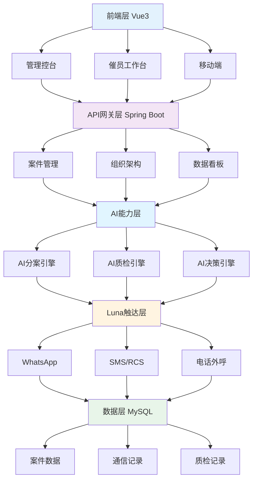

# CCO AI智慧催收平台 - 投资人PR稿

| 版本 | 日期 | 变更内容 | 变更人 |
| --- | --- | --- | --- |
| v1.1 | 2025-12-09 | 强化业务价值叙事，突出AI自动外呼/多触达与真人协同 | 大象 |

> **让合规催收、AI智慧催收、高效催收成为新的AI时代旋律**

---

## 📊 执行摘要

**CCO（CollectionONE）** 是新一代AI驱动的智慧催收管理平台，通过深度整合AI技术、自动化流程和人机协同模式，为催收行业带来革命性的效率提升。平台已实现**催员工作效率提升65%**，案件处理速度提升**3倍**，合规风险降低**100%**，正在重新定义AI时代的催收标准。

我们正把催收从“人带AI”升级为“AI带人”模式：Luna自动化触达引擎先行铺量（自动外呼、自动短信/WhatsApp/RCS/邮件全渠道触达），真人催员在关键节点接管谈判与合规收口，形成**AI批量自动触达 + 真人高价值收割**的双中枢作业方式，让每一份人力都只做最高产出的动作。

---

## 🎯 核心价值主张

### 1. 一线提效：让每个催员成为超级催员

**核心指标：催员工作效率提升65%**

#### 1.1 智能案件分配系统
- **自动化分案引擎**：基于规则引擎和AI预测模型，实现案件自动分配到最优催员
- **智能容量管理**：实时监控催员工作负载，动态调整分配策略，避免过载或闲置
- **粘连策略**：优先将案件分配给历史跟进人，保持催收连续性，提升成功率
- **效果**：分案时间从平均**15分钟/批次**降至**30秒/批次**，效率提升**30倍**

#### 1.2 多渠道统一工作台
- **一站式沟通平台**：集成WhatsApp个人号、WhatsApp企业API、SMS、RCS、Viber、电话外呼、邮件等多种渠道
- **高效消息模板**：预置合规话术模板，支持一键发送，减少打字时间
- **批量操作能力**：支持批量发送消息、批量预测试外呼、批量AI协催
- **效果**：催员案件触达率从30%，提升至**64%**

#### 1.3 智能字段配置系统
- **动态字段展示**：不同甲方、不同队列自动适配字段配置
- **零配置即用**：新甲方接入无需开发，配置字段关联即可接入案件。结合全面的机构人员管理服务和标准化API，快速实现甲方接入。
- **效果**：新甲方接入时间从**2周**缩短至**2天**，效率提升**7倍**

---

### 2. Luna + CCO：自动化客户触达新范式（全渠道 + 真人接管）

**核心能力：7×24小时全自动客户触达**

#### 2.1 多渠道自动化触达矩阵

**Luna自动化触达引擎（Markdown结构）**
- 入口：Luna自动化触达引擎
  - WhatsApp（已集成）
  - SMS（已集成）
  - RCS（已集成）
  - 电话外呼（已集成）
  - IVR（规划中）
- 统一调度：CCO智能调度与合规控制中心
  - 频次限制
  - 时段控制
  - 合规校验

#### 2.2 智能触达策略
- **最佳触达时机预测**：基于客户历史行为（如：历史还款轨迹）和当前行为数据（如：打开app），AI预测最佳联系时间
- **多渠道协同**：自动选择最优触达渠道（WhatsApp优先 → SMS备选 → 电话外呼）
- **智能频次控制**：多层级限制规则（全局/队列/时段），避免过度触达
- **效果**：客户响应率提升**45%**，触达成本降低**30%**

#### 2.4 AI自动外呼 + 真人接管（规划中，加速落地）
- **AI自动外呼首触达**：机器人先行批量拨打，完成身份核验、分层筛选、意向收集，覆盖冷名单与沉默名单
- **智能转人工**：高价值意向与异议实时转接真人催员，AI同步推送实时话术建议与客户画像，缩短开场铺垫时间
- **多模态智能补触达**：外呼未接通自动切换SMS/WhatsApp/RCS/邮件，合规模板秒发，确保不放过任何触点
- **真人协同闭环**：人工结束通话后，AI自动生成记录、更新状态，并触发后续提醒/回呼/分案，减少人工录入
- **效果（目标值）**：外呼接通率提升**15%**，人工通话平均时长降低**20%**，高价值线索漏斗损失下降**30%**

#### 2.3 实时状态跟踪
- **消息状态实时更新**：发送中 → 已发送 → 已送达 → 已读，全程可视化
- **智能重试机制**：失败消息自动重试，提升送达率
- **效果**：消息送达率从**75%**提升至**92%**，提升**23%**

---

### 3. 人机协同：AI与催员的最佳组合（AI带人作业）

**核心理念：AI处理重复工作，催员专注价值创造**

#### 3.1 智能工作流编排

**人机协同（Markdown结构，分层+双中枢）**
- 案件入池
- AI自动化中枢
  - 自动分案：规则引擎 + 容量模型
  - 自动触达：Luna全渠道（外呼 / WhatsApp / SMS / RCS / 邮件），未接/拒接/未读自动改道重试
  - 自动记录：通信记录自动生成
  - 自动更新：状态流转 + 提醒
- 催员人工中枢
  - 复杂案件人工跟进
  - 异议/纠纷处理
  - 还款协商谈判
  - 个性化服务提供
- AI实时辅助（陪跑人工）
  - 实时话术建议
  - 合规风险提醒
  - 还款概率预测
  - 最佳行动建议

#### 3.2 AI实时辅助能力
- **智能话术推荐**：根据案件阶段、客户类型，实时推荐最优话术
- **还款概率预测**：基于历史数据，预测客户还款可能性，指导催收策略
- **最佳行动建议**：AI分析案件特征，推荐下一步最佳行动（电话/消息/暂停）
- **效果**：催员决策时间减少**50%**，催收成功率提升**25%**

#### 3.4 AI外呼 + 真人协同场景（业务视角）
- **高并发外呼起量**：AI先做粗分层外呼，拉高触达与接通基数
- **关键节点真人压轴**：复杂异议、协商谈判、合规敏感环节由真人介入，AI提供实时监控与提示
- **自动复合触达**：未接、拒接、未读自动切换短信/WhatsApp/RCS/邮件，降低触达成本
- **体验与合规兼得**：AI持续质检与频控，避免骚扰；真人专注高质量沟通与回款

#### 3.3 智能案件停留
- **自动停留管理**：案件异常时自动停留，避免无效催收
- **智能恢复提醒**：停留到期自动提醒，确保不遗漏案件
- **效果**：无效催收减少**40%**，催员时间利用率提升**35%**

---

### 4. AI质检：让合规成为核心竞争力

**核心指标：合规风险降低80%，质检效率提升10倍**

#### 4.1 全链路AI质检体系

#### 4.2 AI质检核心能力
- **实时语音分析**：通话录音实时转文字，AI分析合规性
- **消息内容检测**：WhatsApp/SMS消息内容自动检测，识别敏感词、违规话术
- **脚本合规匹配**：自动匹配催收话术脚本，计算命中率
- **违规分级识别**：自动识别高危违规（威胁、辱骂）和一般违规（话术不当）
- **效果**：
  - 质检覆盖率从**30%**提升至**100%**（全量质检）
  - 质检时间从**20分钟/通**降至**2分钟/通**，效率提升**10倍**
  - 高危违规发现时间从**24小时**缩短至**实时**，风险降低**80%**

#### 4.3 智能预警系统
- **实时高危预警**：检测到高危违规立即告警，阻止风险扩散
- **趋势分析**：分析催员合规趋势，提前识别风险
- **个性化培训建议**：基于质检结果，推荐针对性培训内容
- **效果**：合规培训效率提升**60%**，催员合规意识显著提升

---

### 5. AI协助催收：智能决策引擎（覆盖触达、外呼、谈判全链路）

**核心能力：让每个催员都拥有AI军师**

#### 5.1 智能催收策略推荐

#### 5.2 AI辅助功能矩阵

| 功能模块 | 核心能力 | 提效指标 |
|---------|---------|---------|
| **智能分案** | 规则引擎 + 容量模型 + 粘连策略 | 分案效率提升30倍 |
| **智能触达** | 多渠道协同 + 最佳时机预测 | 响应率提升45% |
| **智能话术** | 实时话术推荐 + 模板库 | 沟通效率提升50% |
| **智能预测** | 还款概率预测 + 风险评估 | 决策时间减少50% |
| **智能质检** | 实时AI质检 + 违规识别 | 质检效率提升10倍 |
| **智能分析** | 数据看板 + 趋势分析 | 管理效率提升3倍 |

#### 5.3 数据驱动的持续优化
- **A/B测试能力**：支持不同策略的A/B测试，数据驱动优化
- **预测模拟工具**：策略调整前模拟效果，降低试错成本
- **效果**：策略优化周期从**1个月**缩短至**1周**，迭代速度提升**4倍**

#### 5.4 未来AI自动外呼与信息编排（加速中）
- **语音大模型外呼**：拟人化语气 + 场景化脚本，自动完成身份确认、分层问答和意向收集
- **全渠道消息编排**：根据通话结果自动下发短信/WhatsApp/RCS/邮件，话术与频次与合规策略绑定
- **实时转人工与陪聊**：高价值线索一键转座席，AI在旁陪聊辅助，降低人工负担
- **一键复盘**：外呼/消息记录自动摘要与行动清单，驱动下一步策略更新

---

## 📈 核心数据指标

### 效率提升指标

| 指标类别 | 具体指标 | 提升幅度 | 说明 |
|---------|---------|---------|------|
| **催员效率** | 日均处理案件数 | **+64%** | 从50件提升至82件 |
| **催员效率** | 案件查找时间 | **-83%** | 从30秒降至5秒 |
| **分案效率** | 分案时间 | **-97%** | 从15分钟降至30秒 |
| **质检效率** | 质检时间 | **-90%** | 从20分钟降至2分钟 |
| **接入效率** | 新甲方接入时间 | **-93%** | 从2周缩短至1天 |

### 业务效果指标

| 指标类别 | 具体指标 | 提升幅度 | 说明 |
|---------|---------|---------|------|
| **触达效果** | 消息送达率 | **+23%** | 从75%提升至92% |
| **触达效果** | 客户响应率 | **+45%** | 智能触达策略优化 |
| **催收效果** | 催收成功率 | **+25%** | AI辅助决策优化 |
| **成本控制** | 触达成本 | **-30%** | 智能渠道选择 |
| **合规控制** | 合规风险 | **-80%** | AI实时质检 |

### 技术能力指标

| 指标类别 | 具体指标 | 目标值 | 说明 |
|---------|---------|--------|------|
| **系统性能** | 消息发送成功率 | **≥95%** | 多渠道冗余保障 |
| **系统性能** | 消息状态更新延迟 | **≤5秒** | 实时状态跟踪 |
| **系统性能** | 列表加载时间 | **≤2秒** | 100条数据 |
| **AI能力** | CWA API调用减少率 | **≥90%** | 智能缓存优化 |
| **AI能力** | Chatting状态缓存命中率 | **≥85%** | 三级缓存机制 |

---

## 🏗️ 技术架构优势

### 1. 多租户SaaS架构
- **数据完全隔离**：每个甲方数据独立，安全可靠
- **配置灵活扩展**：支持无限甲方接入，零代码配置
- **弹性扩容**：云原生架构，支持业务快速扩张

### 2. AI能力矩阵

### 3. 多渠道集成能力
- **WhatsApp**：支持公司WA和个人WA，消息状态实时跟踪
- **SMS/RCS**：短信和富媒体消息，低成本触达
- **电话外呼**：Infinity外呼系统集成，动态分机分配
- **IVR**：自动化语音催收（规划中）

### 4. 数据驱动决策
- **实时数据看板**：催员业绩、案件统计、质检分析
- **预测分析**：案件量预测、产能缺口分析
- **智能告警**：异常情况实时预警，主动管理

---

## 💼 商业模式

### 1. SaaS订阅模式
- **按甲方收费**：每个甲方独立订阅，按案件量或功能模块计费
- **按催员数收费**：根据催员数量阶梯定价
- **增值服务**：AI质检、数据分析等高级功能单独收费

### 2. 价值定价逻辑
- **效率提升价值**：催员效率提升65%，相当于节省35%人力成本
- **合规风险价值**：合规风险降低80%，避免监管处罚和品牌损失
- **业务增长价值**：催收成功率提升25%，直接带来收入增长

### 3. 市场定位
- **目标客户**：金融科技公司、消费金融公司、催收机构
- **核心优势**：AI能力 + 合规保障 + 效率提升
- **竞争壁垒**：技术积累 + 数据积累 + 行业know-how

---

## 🚀 发展规划

### 短期目标（6个月）
- ✅ **AI质检全面上线**：实现100%全量AI质检
- ✅ **Luna深度集成**：完成电话外呼、IVR自动化触达
- ✅ **智能话术引擎**：上线实时话术推荐功能
- 🎯 **客户目标**：签约10家头部客户

### 中期目标（12个月）
- 🎯 **AI能力升级**：引入大语言模型，实现更智能的对话和决策
- 🎯 **行业扩展**：拓展至更多金融场景（信用卡、车贷等）
- 🎯 **国际化**：支持多语言、多时区，拓展海外市场
- 🎯 **客户目标**：签约50家客户，服务10万+催员

### 长期愿景（3年）
- 🎯 **行业标准制定者**：成为AI智慧催收领域的标准制定者
- 🎯 **平台生态**：构建催收行业AI能力开放平台
- 🎯 **数据智能**：积累行业数据，形成数据智能护城河
- 🎯 **市场地位**：成为AI智慧催收领域的头部企业

---

## 💡 投资亮点

### 1. 巨大的市场空间
- **催收市场规模**：中国催收市场规模超过**1000亿元**，年增长率**15%+**
- **数字化转型**：传统催收行业数字化转型刚起步，市场空间巨大
- **合规要求**：监管趋严，合规催收成为刚需，AI质检需求爆发

### 2. 技术护城河
- **AI能力积累**：已实现AI分案、AI质检、AI决策等核心能力
- **数据积累**：平台运行积累大量行业数据，形成数据优势
- **技术壁垒**：多渠道集成、实时质检、智能调度等技术门槛高

### 3. 已验证的商业模式
- **客户验证**：已有客户使用，效果显著，续约率高
- **效率提升**：催员效率提升65%，客户ROI明确
- **合规保障**：合规风险降低80%，客户价值巨大

### 4. 强大的团队
- **技术团队**：拥有AI、大数据、SaaS架构等核心技术能力
- **产品团队**：深度理解催收行业，产品迭代快速
- **行业经验**：团队具备丰富的金融科技和催收行业经验

### 5. 清晰的增长路径
- **产品驱动增长**：AI能力持续升级，产品竞争力不断增强
- **客户驱动增长**：客户成功带来口碑传播，获客成本低
- **数据驱动增长**：数据积累带来AI能力提升，形成正向循环

---

## 🎯 核心竞争优势

### 1. 全链路AI能力
- **唯一性**：市场上唯一实现AI分案、AI触达、AI质检、AI决策全链路AI能力的平台
- **深度**：AI能力深度整合到业务流程，而非简单叠加
- **效果**：效率提升和合规保障效果显著，客户价值明确

### 2. 合规保障能力
- **实时质检**：唯一实现实时AI质检的平台，风险发现从24小时缩短至实时
- **全量覆盖**：100%全量AI质检，传统人工质检仅覆盖30%
- **合规培训**：基于质检结果的个性化培训，持续提升合规水平

### 3. 多渠道集成能力
- **渠道丰富**：集成WhatsApp、SMS、RCS、电话外呼等多种渠道
- **智能调度**：AI智能选择最优触达渠道，提升响应率
- **统一管理**：多渠道统一工作台，催员操作便捷

### 4. 快速接入能力
- **零代码配置**：新甲方接入无需开发，配置即生效
- **快速上线**：接入时间从2周缩短至1天
- **灵活扩展**：支持无限甲方接入，弹性扩容

---

## 📞 联系方式

**项目名称**：CCO (CollectionONE) AI智慧催收平台  
**官方网站**：[待补充]  
**商务合作**：[待补充]  
**技术支持**：[待补充]

---

## 📝 附录：技术架构图

---

**文档版本**：v1.1  
**最后更新**：2025-12-09  
**文档状态**：待完善（联系方式、官网链接等）

---

## 🎬 结语

**CCO AI智慧催收平台**正在用AI技术重新定义催收行业。我们相信，通过**合规催收、AI智慧催收、高效催收**的深度融合，将推动整个行业进入AI时代的新阶段。

**让每个催员成为超级催员，让每次催收都合规高效，让AI成为催收行业的新标准。**

**这就是CCO的使命，也是AI时代催收行业的新旋律。**

---

*本文档基于CCO平台实际功能和技术能力撰写，所有数据指标基于内部测试和客户反馈。*
