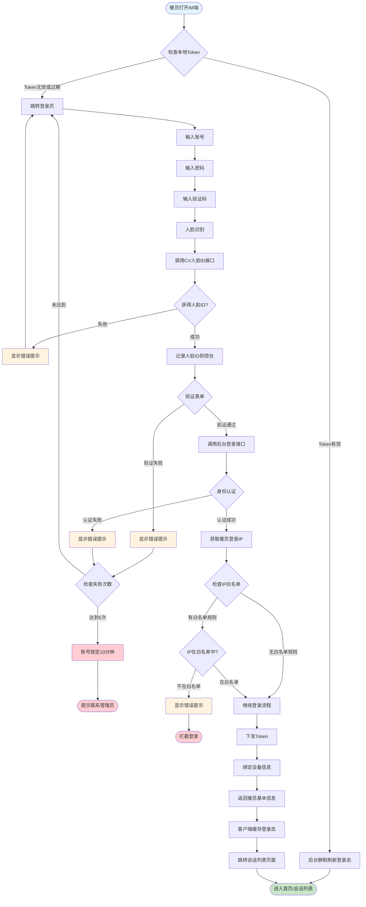

# 一、产品需求（Product Requirements）——催员登录 IM 端

## 1. 项目背景与目标（Background & Goals）

- 背景：目前催员在管理控台和 IM 端登录体验不统一，账号体系分散，存在多终端重复登录、权限不一致、登录态异常失效等问题，影响催员工作效率和安全性。
- 业务痛点：登录失败率偏高（账号/密码不清晰、租户混淆）、登录态不稳定（频繁被踢下线）、账号共享导致责任难以追溯。
- 目标：建设一套统一的催员账号与登录体系，支持 IM 端安全、稳定、低门槛登录；提升催员首次登录成功率、日常登录便捷性，并满足安全合规要求（账号实名、审计留痕）。
- 核心指标：
  - 登录成功率 ≥ 98%（排除密码输错等主观因素）
  - 平均登录响应时间 ≤ 1 秒（P95 ≤ 2 秒）
  - 异常登录审计覆盖率 100%（高危操作均有日志）

## 2. 业务场景与用户画像（Business Scenario & User）

### 2.1 主要用户类型

- 一线催员：日常通过 IM 端（Web H5 ）处理催收对话、查看案件信息，是本需求的核心用户。
- 组长/主管：不能使用IM端，但是可以在控台点击一个催员变身为当前催员，进行信息查看和操作。P2
- 运营/IT 管理员（间接用户）：通过管理控台配置账号、重置密码、控制登录策略，本次需求主要作为依赖方。

## 3. 关键业务流程（Business Flow）

### 3.1 主流程：账号密码登录 IM 端

#### 3.1.1 流程图

#### 3.1.2 流程说明

1. 催员打开 IM 端。
2. 客户端检查本地是否存在有效 Token：
   - 若有效 → 直接进入首页（会话列表），同时在后台静默刷新登录态（如有刷新机制）。
   - 若无效或即将过期 → 跳转登录页。
3. 催员输入账号+ 密码+验证码+人脸识别
	 - 人脸识别说明
		 - 请求CV的催员人脸ID接口，获得一个人脸ID即可通过，不做拦截。
		 - 这个人脸ID要记录在控台端（登录id、人脸Id、登录时间，用于后面的质检）
		 - 当校验失败时，错误提示
	 - 账号、密码、验证码错误，都错误提示
4. 客户端调用后台登录接口，进行身份认证、角色及权限加载。
5. 登录成功：
   - 获得催员登录的ip，和甲方的催员登录白名单进行校对
	   - 无白名单规则：直接往下走
	   - 有白名单规则
	   	- IP不在白名单中，报错提醒，拦截登录
	   	- IP在白名单中，继续往下走
   - 下发访问 Token / 刷新 Token 等登录凭证。
   - 绑定当前设备信息（deviceId、机型、系统版本等）。
   - 返回催员基本信息（姓名、组织、角色）和关键权限。
   - 客户端缓存登录态并跳转会话列表页面。
6. 登录失败：
   - 根据失败原因（密码错误、账号冻结等）返回对应错误码与提示文案。
   - 若达到连续失败次数阈值，账号进入锁定状态，并提示联系管理员。

### 3.2 错误码和文案
1. Password incorrect (Error Code: 401)
2. Account not found (Error Code: 404)
3. Face recognition failed (Error Code: 403)
4. Verification code incorrect (Error Code: 400)
5. Account locked: Your account has been temporarily locked for 10 minutes due to 5 consecutive failed login attempts. Please contact your administrator or try again later. (Error Code: 423)
6. Access denied: Login from this IP address is not allowed. (Error Code: 403)

### 3.3 辅助流程：多终端登录冲突处理

1. 当同一账号从新终端登录时，后台根据配置判定是否允许多端在线。
2. 若不允许或达到上限：
   - 后登录成功 → 将历史终端登录态标记为失效。
   - 向被挤下线终端推送「账号在其他设备登录」的提示，并回到登录页。

## 4. 业务规则与边界（Business Rules & Scope）

### 4.1 账号体系

- 催员登录账号与管理控台账号统一（同一用户 ID / 催员 ID），账号由管理员在管理控台创建与维护。
- 支持通过「手机号 / 工号」登录，具体登录字段在配置中确定。
- 账号与组织（公司/部门/小组）关系保持与现有组织架构一致。

### 4.2 密码与安全规则

- 密码复杂度：长度 ≥ 8，需包含数字 + 字母，是否强制特殊字符由配置决定。
- 登录失败次数阈值：默认 5 次，达到后账号锁定 30 分钟（时间可配置），需管理员手动解锁或系统自动解冻。
- 首次登录或密码重置后，必须在 IM 端强制修改密码。

### 4.3 多终端策略

- 支持配置：
  - 仅允许单终端在线；
  - 允许 N 个终端同时在线（如 PC + 移动）。
- 当达到上限时的新登录行为：
  - 默认策略：后登录踢前登录，并给被踢端显式提示。

### 4.4 租户与环境

- 多租户模式下，同一手机号可能在不同租户下有不同角色；登录时需明确所选租户。
- 本次需求专注于生产/测试环境统一登录能力，环境切换仅在内部测试版本中开放。

### 4.5 范围说明

- 范围内：
  - 登录入口、账号密码验证、登录态管理（Token）、多终端控制、异常与锁定逻辑、基础埋点及登录审计。
- 范围外：
  - 自助找回密码（短信找回/邮箱找回）功能；
  - 完整的 SSO / 第三方登录集成（如钉钉、企业微信），此类能力作为后续迭代。

## 5. 合规与风控要求（Compliance & Risk Control）

### 5.1 账号实名与权限控制

- 催员账号需与真实员工信息绑定（姓名、工号、组织），避免多人共用一个账号。
- 登录后权限控制依赖现有角色/权限体系，确保催员仅能访问与其职责相关的数据。

### 5.2 安全与隐私

- 传输层必须使用 HTTPS，避免明文传输账号密码。
- 密码在服务端以不可逆方式存储（如带盐哈希），禁止明文存储。
- 记录关键登录信息：登录 IP、设备信息、时间、结果（成功/失败原因）。

### 5.3 风控策略

- 异常登录检测（同账号短时间内在不同地区登录、多次失败等）需标记为风险事件。
- 后续可扩展二次验证（如短信或 TOTP），本期仅预留接口及策略配置位。

## 6. 资金路径与结算规则（Funding Flow & Settlement）

- 本需求不涉及资金流和结算，无需资金路径设计。

## 7. 数据字段与口径（Data Definition）

### 7.1 登录请求相关字段（示例）

- userIdentifier：登录标识（手机号 / 工号），来源：催员输入。
- tenantId：租户 ID，来源：租户选择 / 管理后台配置。
- password：密码（仅在传输层加密，服务端只保存哈希），来源：催员输入。
- deviceId：设备唯一标识，来源：客户端。
- deviceType：设备类型（iOS / Android / Web / PC），来源：客户端。
- appVersion：IM 端版本号，来源：客户端。

### 7.2 登录结果相关字段

- loginResult：登录结果（成功/失败）。
- failReasonCode：失败原因编码（密码错误、账号锁定、租户无效等）。
- loginTime：登录时间（精确到秒），口径为系统服务器时间。
- ipAddress：登录 IP，来源：服务端。

# 二、数据需求（Data Requirements）

## 1. 埋点需求（Tracking Requirements）

> 本节按事件列出埋点，后续可整理为表格。

- 事件：im_app_open
  - 触发时机：IM 端启动/冷启动时。
  - 关键属性：userId（若已登录）、tenantId、deviceType、appVersion、channel。

- 事件：im_login_submit
  - 触发时机：点击登录按钮时。
  - 关键属性：userIdentifier（脱敏）、tenantId、deviceType、appVersion、networkType（WiFi/4G）、isRememberMe。

- 事件：im_login_success
  - 触发时机：服务端登录校验通过且客户端拿到有效 Token。
  - 关键属性：userId、tenantId、orgId（组织）、roleId/roleName、deviceType、loginTime、ipProvinceCity（按隐私要求脱敏）。

- 事件：im_login_fail
  - 触发时机：登录失败（包括密码错误、账号锁定、租户无效等）。
  - 关键属性：userIdentifier（脱敏）、tenantId、deviceType、failReasonCode、failReasonDesc、loginTime。

- 事件：im_kickout
  - 触发时机：账号在其他终端登录导致当前终端被踢下线。
  - 关键属性：userId、tenantId、deviceType、reason（多终端登录）、triggerDeviceType。

- 事件：im_logout_click / im_logout_auto
  - 触发时机：用户主动退出 / 登录态自动过期。
  - 关键属性：userId、tenantId、deviceType、logoutType（主动/被动）、sessionDuration。

# 三、技术部分描述（Technical Requirements / TRD）

## 1. 系统架构与模块划分（System Architecture & Modules）

### 1.1 涉及系统

- 催员 IM 前端（移动 APP / Web H5 / PC 客户端）。
- Java 后端认证与用户中心（统一账号体系，端口 8080）。
- 管理控台（用于创建账号、重置密码、配置登录策略）。
- 日志与监控系统（用于收集登录日志与埋点上报）。

### 1.2 主要模块职责

- IM 客户端登录模块：提供登录 UI、输入校验、本地 Token 管理、错误提示。
- 认证服务模块：处理账号密码校验、Token 签发与刷新、多终端策略控制。
- 用户/权限模块：维护催员信息、角色、组织关系，并在登录成功后返回关键信息。
- 审计与埋点模块：记录登录行为日志、上报埋点到数据平台或日志系统。

## 2. 接口设计与系统依赖（API Design & Dependencies）

> 本节为概要说明，详细字段在接口文档中规范。

- 接口：POST `/im/auth/login`
  - 调用方向：IM 客户端 → Java 后端。
  - 主要入参：userIdentifier、password、tenantId、deviceId、deviceType、appVersion。
  - 主要出参：code、message、data（包含 accessToken、refreshToken、expireIn、userId、userName、orgInfo、roleInfo、多端策略信息）。
  - 超时与重试：超时 ≤ 3 秒，客户端仅在网络错误时有限次重试（如 1 次），避免密码错误场景重试。
  - 幂等要求：重复提交同样参数视为独立登录尝试，按安全规则计数。

- 接口：POST `/im/auth/logout`
  - 功能：注销当前 Token，释放会话。

- 接口：POST `/im/auth/refresh`
  - 功能：使用 refreshToken 刷新 accessToken，尽量减少催员重复登录。

- 管理控台/用户中心依赖接口：
  - 账号查询、锁定/解锁、密码重置接口由管理控台或用户中心提供，本需求依赖其能力但不在本次改造范围内。

## 3. 数据存储与模型依赖（Data Storage & Model Dependencies）

### 3.1 核心表（示例，最终以实际设计为准）

- t_im_agent：催员基础信息表（userId、phone、loginName、orgId、status 等）。
- t_im_login_session：登录会话表，记录当前有效会话（userId、tokenId、deviceId、deviceType、loginTime、expireTime、status）。
- t_im_login_audit_log：登录审计日志表，记录每次登录尝试（成功/失败、原因、IP、设备信息）。

### 3.2 索引与主键

- t_im_agent：主键 userId，唯一索引 loginName / phone + tenantId。
- t_im_login_session：索引 userId + deviceId，支持快速查询用户在线终端。

### 3.3 模型依赖

- 当前版本不依赖复杂算法模型，仅依赖规则配置（失败次数阈值、锁定时长、多端策略等）。

## 4. 非功能性要求（Non-Functional Requirements）

- 性能要求：
  - 登录接口 QPS 规划：按峰值在线催员数和集中登录时段设计（例如早班切换），需支持至少峰值 QPS 50–100 并可水平扩展。
  - 响应时间：P95 ≤ 2 秒。
- 可用性与降级：
  - 认证服务需具备高可用部署（多实例 + 负载均衡）。
  - 当部分非关键依赖（如埋点上报）异常时，不影响主登录流程；可采用异步队列或失败重试。
- 安全性：
  - 所有登录相关接口必须进行防刷、防暴力破解保护（如 IP 限流、图形验证码/滑块等能力预留）。

## 5. 日志埋点与监控告警（Logging, Metrics & Alerting）

### 5.1 必须记录的关键日志

- 每次登录请求（脱敏后）与结果，包含 userId / userIdentifier、tenantId、IP、设备信息、result、failReasonCode。
- 多终端踢下线事件日志。

### 5.2 关键监控指标

- 登录成功率（按时间窗口、按租户、按终端类型）。
- 登录失败率及主要失败原因分布。
- 账号锁定次数和占比。

### 5.3 告警规则（示例）

- 某租户 5 分钟内登录总失败率 > 20% 触发告警。
- 单租户连续 10 分钟登录接口错误率（非业务错误，如 5xx）> 5% 触发告警。

## 6. 测试策略与验收标准（Test Plan & Acceptance Criteria）

### 6.1 测试类型

- 单元测试：认证服务、Token 签发与解析、多终端策略逻辑。
- 接口联调测试：IM 客户端与 Java 后端登录接口的对接。
- 回归测试：涉及账号体系的相关功能（管理控台、其他端登录）进行回归。
- 压测：针对登录接口的短时间高并发测试。
- 安全测试：暴力破解防护、异常参数注入、重放攻击等。

### 6.2 关键验收标准（示例）

- 催员在网络正常情况下，登录成功率 ≥ 98%（排除密码输错等用户自身原因）。
- 连续输错密码达到阈值后账号自动锁定，并在后端与前端均可见锁定状态提示。
- 多终端登录策略符合配置，且被踢端有明确提示，不出现「假在线」状态。
- 登录日志与埋点数据能够被正常采集，并在报表/监控中正确展示。

## 7. 发布计划与回滚预案（Release Plan & Rollback）

### 7.1 发布策略

- 后端认证服务先灰度发布（小流量或单租户），验证正确后全量切换。
- IM 客户端版本采用分批升级策略，支持新旧登录流程短期并行（如有兼容逻辑）。

### 7.2 配置与开关

- 提供开关控制新登录策略是否生效（如新多终端策略、强制首登改密等）。
- 出现重大问题时，可通过配置切回旧策略或关闭部分风控规则。

### 7.3 回滚方案

- 如发现严重登录失败或异常，需立即：
  - 降级/关闭新登录能力的配置开关；
  - 回滚认证服务到上一稳定版本。
- 回滚后需保证已登录用户不受影响，登录日志不丢失。

