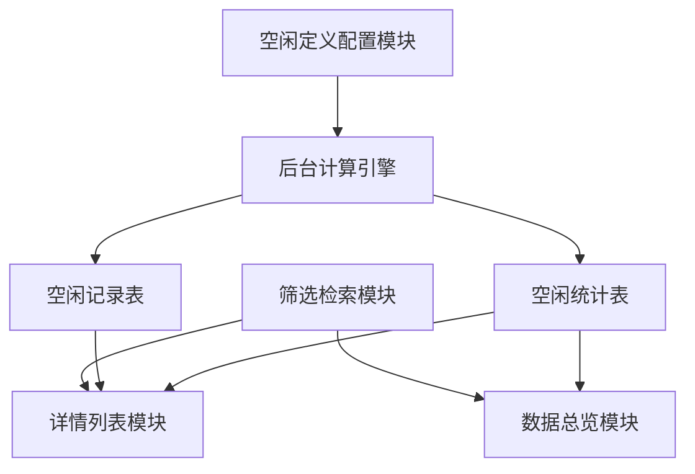
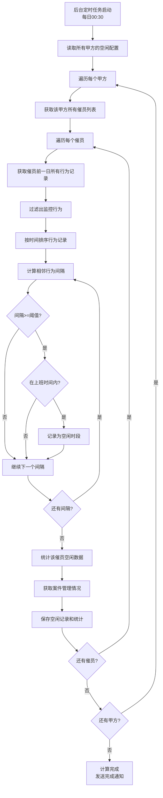

# CCO系统 - 空闲催员监控看板 PRD

## 文档信息

| 项目 | 内容 |
|------|------|
| 文档名称 | CCO系统空闲催员监控看板产品需求文档 |
| 版本号 | V1.0 |
| 创建日期 | 2025-11-20 |
| 最后更新 | 2025-11-20 |
| 产品经理 | - |
| 开发团队 | CCO开发团队 |

## 目录

1. [需求概述](#需求概述)
2. [功能架构](#功能架构)
3. [详细功能设计](#详细功能设计)
4. [数据模型](#数据模型)
5. [接口设计](#接口设计)
6. [用户界面设计](#用户界面设计)
7. [业务流程](#业务流程)
8. [非功能性需求](#非功能性需求)
9. [实施计划](#实施计划)

---

## 需求概述

### 1.1 背景

在CCO催收管理系统中，催员的工作效率直接影响催收效果。管理层需要实时监控催员的工作状态，识别空闲时段，以便：
- 优化人力资源配置
- 及时发现工作异常情况
- 提升整体催收效率
- 加强团队管理水平

当前系统缺少对催员空闲时段的系统性监控和分析能力，需要建立专门的空闲催员监控看板。

### 1.2 目标

1. **实时监控**：实时或准实时监控催员工作状态
2. **智能识别**：基于可配置规则自动识别空闲时段
3. **多维分析**：支持按机构、小组、催员等维度分析
4. **灵活配置**：支持自定义空闲定义规则
5. **数据可视**：通过图表和时间轴清晰展示空闲情况

### 1.3 用户角色

| 角色 | 职责 | 权限 |
|------|------|------|
| 系统管理员 | 配置空闲定义规则、查看所有数据 | 完全权限 |
| 甲方管理员 | 查看所有机构数据、配置监控规则 | 甲方范围内完全权限 |
| 机构管理员 | 查看本机构数据 | 本机构只读权限 |
| 小组长 | 查看本小组数据 | 本小组只读权限 |

---

## 功能架构

### 2.1 功能模块

```
空闲催员监控看板
├── 筛选检索模块
│   ├── 机构筛选（支持多选）
│   ├── 小组筛选（支持多选）
│   ├── 催员筛选（支持搜索）
│   └── 日期筛选（单日/日期范围）
├── 空闲定义配置模块
│   ├── 上班时间段配置
│   ├── 空闲时长阈值配置
│   ├── 监控行为配置
│   └── 配置历史版本管理
├── 数据总览模块
│   ├── 空闲催员总数
│   ├── 空闲总次数
│   ├── 空闲总时长统计
│   └── 趋势图表
└── 详情列表模块
    ├── 催员基本信息
    ├── 案件管理情况
    ├── 空闲统计数据
    └── 空闲时段明细
```

### 2.2 模块关系图



---

## 详细功能设计

### 3.1 筛选检索功能

#### 3.1.1 机构筛选

**功能描述**：
- 下拉多选框
- 支持搜索机构名称
- 显示机构代码和名称
- 默认显示当前用户权限范围内的所有机构

**交互说明**：
- 点击下拉框展开机构列表
- 输入关键字实时过滤
- 勾选/取消勾选机构
- 支持"全选"和"清空"快捷操作

**权限控制**：
- 系统管理员/甲方管理员：可选择所有机构
- 机构管理员：只能选择所属机构
- 小组长：只能选择所属机构（不可修改）

#### 3.1.2 小组筛选

**功能描述**：
- 级联筛选（先选机构，再选小组）
- 支持多选
- 显示小组名称和人数
- 支持"全选"和"清空"

**交互说明**：
- 选择机构后，小组列表自动更新
- 显示格式：小组名称（X人）
- 支持搜索小组名称

**权限控制**：
- 小组长：只能选择所属小组（不可修改）

#### 3.1.3 催员筛选

**功能描述**：
- 搜索框支持姓名、工号搜索
- 下拉列表展示
- 支持多选
- 显示催员姓名、工号、所属小组

**交互说明**：
- 输入关键字实时搜索
- 显示格式：姓名（工号）- 小组名称
- 支持快速清空

#### 3.1.4 日期筛选

**功能描述**：
- 单日选择：查看某一天的数据
- 日期范围：查看一段时间的汇总数据
- 支持快捷选项：今天、昨天、最近7天、最近30天
- 最大支持90天范围

**交互说明**：
- 默认显示"今天"
- 日期范围选择时，显示开始日期和结束日期
- 超过90天提示并限制

**数据说明**：
- 单日模式：显示该日每个催员的详细空闲记录
- 范围模式：显示时间段内的汇总统计

### 3.2 空闲定义配置

#### 3.2.1 配置入口

**打开方式**：
- 页面右上角"空闲配置"按钮
- 点击弹出配置对话框

**权限要求**：
- 系统管理员和甲方管理员可配置
- 其他角色只能查看当前配置

#### 3.2.2 上班时间段配置

**功能描述**：
- 支持配置多个时间段（如：9:00-12:00, 14:00-18:00）
- 可按工作日分别配置
- 支持节假日排除
- 时间格式：HH:MM

**配置项**：

| 配置项 | 类型 | 必填 | 说明 | 示例 |
|--------|------|------|------|------|
| 时间段列表 | Array | 是 | 多个时间段 | [{"start":"09:00","end":"12:00"}] |
| 开始时间 | String | 是 | HH:MM格式 | "09:00" |
| 结束时间 | String | 是 | HH:MM格式 | "12:00" |
| 排除节假日 | Boolean | 否 | 是否排除节假日 | true |

**交互说明**：
- 点击"添加时间段"可增加新时间段
- 每个时间段可单独删除
- 时间段不能重叠，系统自动校验
- 最少配置1个时间段，最多5个

**示例配置**：
```json
{
  "work_time_slots": [
    {"start": "09:00", "end": "12:00"},
    {"start": "14:00", "end": "18:00"}
  ],
  "exclude_holidays": true
}
```

#### 3.2.3 空闲时长阈值配置（x分钟）

**功能描述**：
- 输入框，允许输入正整数
- 单位：分钟
- 默认值：30分钟
- 范围：5-120分钟

**配置说明**：
在设定的时间内，如果催员未发生任何监控行为，则判定为空闲。

**示例**：
- 设置30分钟：催员30分钟内无任何行为记录，则记录为空闲
- 设置15分钟：更严格的监控标准

**校验规则**：
- 必须为正整数
- 最小值：5分钟
- 最大值：120分钟
- 超出范围提示错误

#### 3.2.4 监控行为配置（y行为）

**功能描述**：
支持多选的行为类型，用于判定催员是否在工作状态。

**行为列表**：

| 行为类型 | 标识 | 说明 | 默认 |
|---------|------|------|------|
| 打电话 | call | 拨打外呼电话 | ☑ |
| 发送WhatsApp | whatsapp | 发送WA消息 | ☑ |
| 发送RCS | rcs | 发送RCS消息 | ☑ |
| 发送SMS | sms | 发送短信 | ☑ |
| 发送邮件 | email | 发送邮件 | ☑ |
| 案件操作 | case_update | 更新案件状态、添加备注等 | ☑ |
| 系统登录 | login | 登录系统 | ☑ |

**交互说明**：
- 复选框多选
- 至少选择一项行为
- 默认全选
- 提供"全选"和"清空"快捷按钮

**判定逻辑**：
只要在时间窗口内发生任一选中的行为，就不算空闲。

**示例配置**：
```json
{
  "monitored_actions": [
    "call",
    "whatsapp",
    "rcs",
    "sms",
    "email",
    "case_update",
    "login"
  ]
}
```

#### 3.2.5 配置保存和生效

**保存逻辑**：
- 配置按甲方维度保存
- 保存后立即生效
- 记录配置变更历史
- 记录操作人和操作时间

**生效机制**：
- 新配置立即应用于后续计算
- 历史数据不受影响
- 支持重新计算历史数据（可选）

**配置历史**：
- 点击"查看历史"按钮
- 显示历史配置列表
- 支持对比不同版本
- 支持恢复历史配置

#### 3.2.6 完整配置示例

**标准配置**：
```json
{
  "config_name": "标准工作日规则",
  "work_time_slots": [
    {"start": "09:00", "end": "12:00"},
    {"start": "14:00", "end": "18:00"}
  ],
  "idle_threshold_minutes": 30,
  "monitored_actions": ["call", "whatsapp", "sms", "case_update"],
  "exclude_holidays": true
}
```

**严格配置**：
```json
{
  "config_name": "严格监控规则",
  "work_time_slots": [
    {"start": "08:30", "end": "12:00"},
    {"start": "13:30", "end": "18:30"}
  ],
  "idle_threshold_minutes": 15,
  "monitored_actions": [
    "call", "whatsapp", "rcs", "sms", 
    "email", "case_update", "login"
  ],
  "exclude_holidays": true
}
```

### 3.3 数据总览展示

#### 3.3.1 核心指标卡片

**指标1：空闲催员总数**
- **定义**：在筛选条件下，有空闲记录的催员人数
- **显示**：大数字 + 环比变化
- **示例**：28人 ↑ 15%
- **颜色**：红色（警示）

**指标2：空闲总次数**
- **定义**：所有催员的空闲次数总和
- **显示**：大数字 + 环比变化
- **示例**：156次 ↑ 8%
- **颜色**：橙色

**指标3：空闲总时长**
- **定义**：所有催员的空闲时长总和
- **显示**：小时数 + 环比变化
- **示例**：87.5小时 ↑ 12%
- **颜色**：红色

**指标4：平均空闲时长**
- **定义**：空闲总时长 / 空闲总次数
- **显示**：分钟数
- **示例**：33.6分钟
- **颜色**：黄色

**卡片布局**：
```
┌──────────────┐ ┌──────────────┐ ┌──────────────┐ ┌──────────────┐
│ 空闲催员总数 │ │ 空闲总次数   │ │ 空闲总时长   │ │ 平均空闲时长 │
│              │ │              │ │              │ │              │
│    28人      │ │   156次      │ │  87.5小时    │ │  33.6分钟    │
│   ↑ 15%     │ │   ↑ 8%      │ │   ↑ 12%     │ │   ↑ 5%      │
└──────────────┘ └──────────────┘ └──────────────┘ └──────────────┘
```

**环比计算**：
- 单日模式：与前一日对比
- 范围模式：与上一个相同周期对比

#### 3.3.2 趋势图表

**图表类型**：折线图（ECharts）

**图表配置**：
- **横轴**：日期
- **纵轴**：可切换指标
  - 空闲催员数量
  - 空闲总次数
  - 空闲总时长（小时）
  - 平均空闲时长（分钟）

**交互功能**：
- 鼠标悬停显示详细数据
- 支持图例切换
- 支持数据缩放
- 点击日期可跳转到该日详情

**显示范围**：
- 最多显示30天数据
- 自动聚合显示

### 3.4 详情列表展示

#### 3.4.1 表格列定义

| 列名 | 字段 | 宽度 | 排序 | 格式 | 说明 |
|------|------|------|------|------|------|
| 催员姓名 | collector_name | 120px | ✓ | 姓名（工号） | 点击查看详情 |
| 所属机构 | agency_name | 150px | ✓ | 文本 | - |
| 所属小组 | team_name | 120px | ✓ | 文本 | - |
| 统计日期 | stat_date | 100px | ✓ | YYYY-MM-DD | - |
| 管理案件数 | managed_cases | 120px | ✓ | 已还/总计 | 格式：12/50 |
| 管理案件金额 | managed_amount | 150px | ✓ | 货币 | 格式：¥125,000/¥500,000 |
| 空闲次数 | idle_count | 100px | ✓ | 数字 | 降序默认 |
| 总计空闲时长 | total_idle_minutes | 120px | ✓ | X小时Y分钟 | 格式：2小时2分钟 |
| 空闲时段 | idle_periods | 200px | - | 列表 | 可展开查看 |
| 操作 | actions | 100px | - | 按钮 | 查看详情 |

#### 3.4.2 案件管理情况详细说明

**数据来源**：
- 催员在统计日期负责的案件
- 从案件管理系统获取数据

**字段说明**：

| 字段 | 计算方式 | 说明 |
|------|---------|------|
| 总案件数 | COUNT(案件) | 催员负责的案件总数 |
| 已还案件数 | COUNT(有还款的案件) | 在统计日期内有还款记录的案件数 |
| 总金额 | SUM(案件欠款金额) | 所有案件的总欠款金额 |
| 已还金额 | SUM(还款金额) | 在统计日期内的还款总额 |

**显示格式**：
- 案件数：`12/50`（已还/总计）
- 金额：`¥125,000/¥500,000`（已还/总计）

**颜色标记**：
- 案件催回率 > 30%：绿色
- 案件催回率 15-30%：黄色
- 案件催回率 < 15%：红色

#### 3.4.3 空闲时段展示

**紧凑模式（表格中）**：
- 显示空闲次数
- 点击"[+]"展开详细时段
- 展开后显示每个时段的起止时间和时长

**展开格式**：
```
空闲时段:
• 09:15-09:52 (37分钟)
• 14:20-15:05 (45分钟)
• 16:30-17:10 (40分钟)
```

**详情模式（详情弹窗中）**：
- 时间轴可视化展示
- 显示上下文行为
- 支持点击查看详情

#### 3.4.4 分页和排序

**分页配置**：
- 默认每页20条
- 支持10/20/50/100条切换
- 显示总条数和页码

**排序功能**：
- 默认按"空闲次数"降序排序
- 点击列头切换升序/降序
- 支持多列排序（按住Shift键）

**排序标识**：
- ▲ 升序
- ▼ 降序
- 默认无标识

### 3.5 详情弹窗

#### 3.5.1 触发方式

- 点击催员姓名
- 点击"查看详情"按钮

#### 3.5.2 弹窗布局

```
┌─────────────────────────────────────────────────────────┐
│ 催员空闲详情 - 张三 (C001)                        [×]  │
├─────────────────────────────────────────────────────────┤
│ [基本信息] [案件情况] [空闲明细]                       │
│                                                         │
│ 基本信息区域                                            │
│ ┌─────────────────────────────────────────────────────┐ │
│ │ 姓名: 张三        工号: C001      所属机构: 机构A  │ │
│ │ 小组: 小组1       统计日期: 2025-11-20             │ │
│ └─────────────────────────────────────────────────────┘ │
│                                                         │
│ 空闲统计卡片                                            │
│ ┌────────────┐ ┌────────────┐ ┌────────────┐         │
│ │ 空闲次数   │ │ 总计时长   │ │ 平均时长   │         │
│ │   3次      │ │  122分钟   │ │  40.7分钟  │         │
│ └────────────┘ └────────────┘ └────────────┘         │
│                                                         │
│ 案件管理情况                                            │
│ ┌─────────────────────────────────────────────────────┐ │
│ │ 总案件: 50件    已还: 12件    催回率: 24%          │ │
│ │ 总金额: ¥500,000  已还: ¥125,000  回款率: 25%     │ │
│ └─────────────────────────────────────────────────────┘ │
│                                                         │
│ 空闲时段时间轴                                          │
│ ┌─────────────────────────────────────────────────────┐ │
│ │ 工作时间轴 (09:00 - 18:00)                         │ │
│ │ 09:00 ▓▓▓████▓▓▓▓▓▓ 12:00 ████▓▓▓████ 18:00      │ │
│ │        空闲1              空闲2   空闲3            │ │
│ └─────────────────────────────────────────────────────┘ │
│                                                         │
│ 空闲明细列表                                            │
│ ┌─────────────────────────────────────────────────────┐ │
│ │ 1. 09:15 - 09:52 (37分钟)                          │ │
│ │    之前行为: 打电话 @ 09:14                         │ │
│ │    之后行为: 登录系统 @ 09:52                       │ │
│ │                                                     │ │
│ │ 2. 14:20 - 15:05 (45分钟)                          │ │
│ │    之前行为: 发送SMS @ 14:19                        │ │
│ │    之后行为: 打电话 @ 15:05                         │ │
│ │                                                     │ │
│ │ 3. 16:30 - 17:10 (40分钟)                          │ │
│ │    之前行为: 案件操作 @ 16:28                       │ │
│ │    之后行为: 下班（无后续行为）                     │ │
│ └─────────────────────────────────────────────────────┘ │
│                                                         │
│                         [导出报告] [关闭]              │
└─────────────────────────────────────────────────────────┘
```

#### 3.5.3 时间轴可视化

**设计说明**：
- 使用色块表示空闲时段
- 深色块：工作时段
- 浅色块/红色块：空闲时段
- 鼠标悬停显示详细信息

**交互功能**：
- 点击空闲时段高亮对应明细
- 支持缩放查看
- 显示精确时间

#### 3.5.4 导出功能

**导出格式**：PDF报告

**报告内容**：
- 催员基本信息
- 空闲统计数据
- 案件管理情况
- 空闲时段明细列表
- 时间轴图表

---

## 数据模型

### 4.1 空闲监控配置表 (idle_monitor_configs)

| 字段名 | 类型 | 长度 | 可空 | 默认值 | 说明 |
|--------|------|------|------|--------|------|
| id | BIGINT | - | NO | AUTO | 主键 |
| tenant_id | BIGINT | - | NO | - | 甲方ID |
| config_name | VARCHAR | 100 | NO | - | 配置名称 |
| work_time_slots | JSON | - | NO | - | 上班时间段 |
| idle_threshold_minutes | INT | - | NO | 30 | 空闲阈值（分钟） |
| monitored_actions | JSON | - | NO | - | 监控行为列表 |
| exclude_holidays | BOOLEAN | - | NO | true | 是否排除节假日 |
| is_active | BOOLEAN | - | NO | true | 是否启用 |
| created_by | VARCHAR | 100 | YES | - | 创建人 |
| created_at | DATETIME | - | NO | NOW() | 创建时间 |
| updated_at | DATETIME | - | NO | NOW() | 更新时间 |

**索引**：
- PRIMARY KEY (id)
- UNIQUE KEY uk_tenant (tenant_id, config_name)
- KEY idx_tenant_active (tenant_id, is_active)

**work_time_slots 字段结构**：
```json
[
  {"start": "09:00", "end": "12:00"},
  {"start": "14:00", "end": "18:00"}
]
```

**monitored_actions 字段结构**：
```json
["call", "whatsapp", "rcs", "sms", "email", "case_update", "login"]
```

### 4.2 催员空闲记录表 (collector_idle_records)

| 字段名 | 类型 | 长度 | 可空 | 默认值 | 说明 |
|--------|------|------|------|--------|------|
| id | BIGINT | - | NO | AUTO | 主键 |
| tenant_id | BIGINT | - | NO | - | 甲方ID |
| collector_id | BIGINT | - | NO | - | 催员ID |
| agency_id | BIGINT | - | NO | - | 机构ID |
| team_id | BIGINT | - | NO | - | 小组ID |
| idle_date | DATE | - | NO | - | 空闲日期 |
| idle_start_time | DATETIME | - | NO | - | 空闲开始时间 |
| idle_end_time | DATETIME | - | NO | - | 空闲结束时间 |
| idle_duration_minutes | INT | - | NO | - | 空闲时长（分钟） |
| before_action | JSON | - | YES | - | 空闲前的行为 |
| after_action | JSON | - | YES | - | 空闲后的行为 |
| config_id | BIGINT | - | NO | - | 应用的配置ID |
| created_at | DATETIME | - | NO | NOW() | 创建时间 |

**索引**：
- PRIMARY KEY (id)
- KEY idx_collector_date (collector_id, idle_date)
- KEY idx_tenant_date (tenant_id, idle_date)
- KEY idx_agency_date (agency_id, idle_date)
- KEY idx_team_date (team_id, idle_date)

**before_action/after_action 字段结构**：
```json
{
  "type": "call",
  "time": "2025-11-20 09:14:55",
  "details": "拨打电话给客户XXX"
}
```

### 4.3 催员空闲统计表 (collector_idle_stats)

| 字段名 | 类型 | 长度 | 可空 | 默认值 | 说明 |
|--------|------|------|------|--------|------|
| id | BIGINT | - | NO | AUTO | 主键 |
| tenant_id | BIGINT | - | NO | - | 甲方ID |
| collector_id | BIGINT | - | NO | - | 催员ID |
| agency_id | BIGINT | - | NO | - | 机构ID |
| team_id | BIGINT | - | NO | - | 小组ID |
| stat_date | DATE | - | NO | - | 统计日期 |
| idle_count | INT | - | NO | 0 | 空闲次数 |
| total_idle_minutes | INT | - | NO | 0 | 总空闲时长（分钟） |
| longest_idle_minutes | INT | - | NO | 0 | 最长单次空闲（分钟） |
| avg_idle_minutes | DECIMAL | 10,2 | NO | 0 | 平均空闲时长（分钟） |
| work_minutes | INT | - | NO | 0 | 工作时长（分钟） |
| idle_rate | DECIMAL | 5,4 | NO | 0 | 空闲率 |
| managed_cases_total | INT | - | NO | 0 | 管理案件总数 |
| managed_cases_collected | INT | - | NO | 0 | 已还案件数 |
| managed_amount_total | DECIMAL | 15,2 | NO | 0 | 管理金额总计 |
| managed_amount_collected | DECIMAL | 15,2 | NO | 0 | 已还金额 |
| created_at | DATETIME | - | NO | NOW() | 创建时间 |
| updated_at | DATETIME | - | NO | NOW() | 更新时间 |

**索引**：
- PRIMARY KEY (id)
- UNIQUE KEY uk_collector_date (collector_id, stat_date)
- KEY idx_tenant_date (tenant_id, stat_date)
- KEY idx_agency_date (agency_id, stat_date)
- KEY idx_team_date (team_id, stat_date)
- KEY idx_idle_count (idle_count)

---

## 接口设计

### 5.1 空闲配置管理接口

#### 5.1.1 获取当前配置

**接口**：
```
GET /api/v1/idle-monitor/config
```

**Query参数**：

| 参数 | 类型 | 必填 | 说明 |
|------|------|------|------|
| tenant_id | String | 是 | 甲方ID |

**响应示例**：
```json
{
  "code": 200,
  "message": "success",
  "data": {
    "id": 1,
    "tenant_id": "1001",
    "config_name": "标准工作日规则",
    "work_time_slots": [
      {"start": "09:00", "end": "12:00"},
      {"start": "14:00", "end": "18:00"}
    ],
    "idle_threshold_minutes": 30,
    "monitored_actions": ["call", "whatsapp", "sms", "case_update"],
    "exclude_holidays": true,
    "is_active": true,
    "created_at": "2025-11-20 10:00:00",
    "updated_at": "2025-11-20 10:00:00"
  }
}
```

#### 5.1.2 创建或更新配置

**接口**：
```
POST /api/v1/idle-monitor/config
PUT /api/v1/idle-monitor/config/{id}
```

**请求体**：
```json
{
  "tenant_id": "1001",
  "config_name": "标准工作日规则",
  "work_time_slots": [
    {"start": "09:00", "end": "12:00"},
    {"start": "14:00", "end": "18:00"}
  ],
  "idle_threshold_minutes": 30,
  "monitored_actions": ["call", "whatsapp", "sms", "case_update"],
  "exclude_holidays": true
}
```

**响应示例**：
```json
{
  "code": 200,
  "message": "配置保存成功",
  "data": {
    "id": 1,
    "tenant_id": "1001",
    "config_name": "标准工作日规则",
    "is_active": true,
    "created_at": "2025-11-20 10:00:00"
  }
}
```

#### 5.1.3 获取配置历史

**接口**：
```
GET /api/v1/idle-monitor/config/history
```

**Query参数**：

| 参数 | 类型 | 必填 | 说明 |
|------|------|------|------|
| tenant_id | String | 是 | 甲方ID |
| page | Integer | 否 | 页码，默认1 |
| page_size | Integer | 否 | 每页条数，默认10 |

**响应示例**：
```json
{
  "code": 200,
  "message": "success",
  "data": {
    "total": 5,
    "page": 1,
    "page_size": 10,
    "items": [
      {
        "id": 5,
        "config_name": "标准工作日规则",
        "created_by": "admin",
        "created_at": "2025-11-20 10:00:00",
        "is_active": true
      }
    ]
  }
}
```

### 5.2 空闲数据查询接口

#### 5.2.1 获取总览数据

**接口**：
```
GET /api/v1/idle-monitor/summary
```

**Query参数**：

| 参数 | 类型 | 必填 | 说明 |
|------|------|------|------|
| tenant_id | String | 是 | 甲方ID |
| agency_ids | String | 否 | 机构ID列表，逗号分隔 |
| team_ids | String | 否 | 小组ID列表，逗号分隔 |
| collector_ids | String | 否 | 催员ID列表，逗号分隔 |
| start_date | String | 是 | 开始日期，YYYY-MM-DD |
| end_date | String | 是 | 结束日期，YYYY-MM-DD |

**响应示例**：
```json
{
  "code": 200,
  "message": "success",
  "data": {
    "total_idle_collectors": 28,
    "total_idle_count": 156,
    "total_idle_minutes": 5250,
    "total_idle_hours": 87.5,
    "avg_idle_minutes": 33.6,
    "comparison": {
      "collectors_change": 0.15,
      "count_change": 0.08,
      "minutes_change": 0.12,
      "avg_change": 0.05
    }
  }
}
```

#### 5.2.2 获取详情列表

**接口**：
```
GET /api/v1/idle-monitor/details
```

**Query参数**：

| 参数 | 类型 | 必填 | 说明 |
|------|------|------|------|
| tenant_id | String | 是 | 甲方ID |
| agency_ids | String | 否 | 机构ID列表 |
| team_ids | String | 否 | 小组ID列表 |
| collector_ids | String | 否 | 催员ID列表 |
| start_date | String | 是 | 开始日期 |
| end_date | String | 是 | 结束日期 |
| page | Integer | 否 | 页码，默认1 |
| page_size | Integer | 否 | 每页条数，默认20 |
| sort_by | String | 否 | 排序字段，默认idle_count |
| sort_order | String | 否 | 排序方向，asc/desc，默认desc |

**响应示例**：
```json
{
  "code": 200,
  "message": "success",
  "data": {
    "total": 28,
    "page": 1,
    "page_size": 20,
    "items": [
      {
        "collector_id": 5001,
        "collector_name": "张三",
        "collector_code": "C001",
        "agency_id": 2001,
        "agency_name": "机构A",
        "team_id": 3001,
        "team_name": "小组1",
        "stat_date": "2025-11-20",
        "idle_count": 3,
        "total_idle_minutes": 122,
        "longest_idle_minutes": 45,
        "avg_idle_minutes": 40.67,
        "idle_rate": 0.254,
        "managed_cases": {
          "total": 50,
          "collected": 12,
          "collection_rate": 0.24
        },
        "managed_amount": {
          "total": 500000.00,
          "collected": 125000.00,
          "collection_rate": 0.25
        },
        "idle_periods": [
          {
            "start": "09:15:00",
            "end": "09:52:00",
            "duration": 37
          },
          {
            "start": "14:20:00",
            "end": "15:05:00",
            "duration": 45
          },
          {
            "start": "16:30:00",
            "end": "17:10:00",
            "duration": 40
          }
        ]
      }
    ]
  }
}
```

#### 5.2.3 获取催员详细信息

**接口**：
```
GET /api/v1/idle-monitor/collector/{collector_id}/detail
```

**Path参数**：

| 参数 | 类型 | 说明 |
|------|------|------|
| collector_id | Integer | 催员ID |

**Query参数**：

| 参数 | 类型 | 必填 | 说明 |
|------|------|------|------|
| date | String | 是 | 日期，YYYY-MM-DD |

**响应示例**：
```json
{
  "code": 200,
  "message": "success",
  "data": {
    "collector_info": {
      "id": 5001,
      "name": "张三",
      "code": "C001",
      "agency_name": "机构A",
      "team_name": "小组1"
    },
    "stat_date": "2025-11-20",
    "idle_summary": {
      "idle_count": 3,
      "total_idle_minutes": 122,
      "avg_idle_minutes": 40.67,
      "longest_idle_minutes": 45
    },
    "case_summary": {
      "total_cases": 50,
      "collected_cases": 12,
      "collection_rate": 0.24,
      "total_amount": 500000.00,
      "collected_amount": 125000.00,
      "amount_collection_rate": 0.25
    },
    "idle_details": [
      {
        "start_time": "2025-11-20 09:15:00",
        "end_time": "2025-11-20 09:52:00",
        "duration_minutes": 37,
        "before_action": {
          "type": "call",
          "time": "2025-11-20 09:14:55",
          "details": "拨打电话"
        },
        "after_action": {
          "type": "login",
          "time": "2025-11-20 09:52:03",
          "details": "登录系统"
        }
      },
      {
        "start_time": "2025-11-20 14:20:00",
        "end_time": "2025-11-20 15:05:00",
        "duration_minutes": 45,
        "before_action": {
          "type": "sms",
          "time": "2025-11-20 14:19:30",
          "details": "发送SMS"
        },
        "after_action": {
          "type": "call",
          "time": "2025-11-20 15:05:12",
          "details": "拨打电话"
        }
      },
      {
        "start_time": "2025-11-20 16:30:00",
        "end_time": "2025-11-20 17:10:00",
        "duration_minutes": 40,
        "before_action": {
          "type": "case_update",
          "time": "2025-11-20 16:28:00",
          "details": "案件操作"
        },
        "after_action": null
      }
    ]
  }
}
```

#### 5.2.4 获取趋势数据

**接口**：
```
GET /api/v1/idle-monitor/trend
```

**Query参数**：

| 参数 | 类型 | 必填 | 说明 |
|------|------|------|------|
| tenant_id | String | 是 | 甲方ID |
| agency_ids | String | 否 | 机构ID列表 |
| team_ids | String | 否 | 小组ID列表 |
| start_date | String | 是 | 开始日期 |
| end_date | String | 是 | 结束日期 |
| metric | String | 否 | 指标类型：collectors/count/minutes/avg，默认collectors |

**响应示例**：
```json
{
  "code": 200,
  "message": "success",
  "data": {
    "metric": "collectors",
    "dates": [
      "2025-11-15",
      "2025-11-16",
      "2025-11-17",
      "2025-11-18",
      "2025-11-19",
      "2025-11-20"
    ],
    "values": [25, 28, 23, 30, 27, 28]
  }
}
```

### 5.3 数据导出接口

#### 5.3.1 导出详情列表

**接口**：
```
GET /api/v1/idle-monitor/export
```

**Query参数**：同详情列表接口

**响应**：
- Content-Type: application/vnd.openxmlformats-officedocument.spreadsheetml.sheet
- 文件名：空闲催员监控_{日期}.xlsx

**Excel内容**：
- Sheet1: 空闲催员列表
- Sheet2: 空闲时段明细

---

## 用户界面设计

### 6.1 页面整体布局

```
┌─────────────────────────────────────────────────────────────────┐
│ 空闲催员监控看板                          [空闲配置] [导出]    │
├─────────────────────────────────────────────────────────────────┤
│ 筛选区域                                                        │
│ ┌─────────────────────────────────────────────────────────────┐ │
│ │ 机构: [全部 ▼]  小组: [全部 ▼]  催员: [搜索催员...]        │ │
│ │ 日期: [今天 ▼] [2025-11-20]                  [查询] [重置]  │ │
│ └─────────────────────────────────────────────────────────────┘ │
├─────────────────────────────────────────────────────────────────┤
│ 总览区域                                                        │
│ ┌──────────────┐ ┌──────────────┐ ┌──────────────┐ ┌─────────┐│
│ │空闲催员总数  │ │空闲总次数    │ │空闲总时长    │ │平均空闲 ││
│ │              │ │              │ │              │ │时长     ││
│ │    28人      │ │   156次      │ │  87.5小时    │ │33.6分钟 ││
│ │   ↑ 15%     │ │   ↑ 8%      │ │   ↑ 12%     │ │ ↑ 5%   ││
│ └──────────────┘ └──────────────┘ └──────────────┘ └─────────┘│
├─────────────────────────────────────────────────────────────────┤
│ 趋势图表区域                                                    │
│ ┌─────────────────────────────────────────────────────────────┐ │
│ │ [空闲催员数 ▼]                                              │ │
│ │                                                             │ │
│ │  30 ┤                                  ●                   │ │
│ │  28 ┤        ●               ●              ●              │ │
│ │  25 ┤  ●                ●                                  │ │
│ │  23 ┤                                                      │ │
│ │     └────────────────────────────────────────────────────  │ │
│ │      11-15  11-16  11-17  11-18  11-19  11-20             │ │
│ └─────────────────────────────────────────────────────────────┘ │
├─────────────────────────────────────────────────────────────────┤
│ 详情列表区域                                                    │
│ ┌─────────────────────────────────────────────────────────────┐ │
│ │催员  │机构│小组│日期  │案件      │金额         │空闲│时长│  │ │
│ │      │    │    │      │          │             │次数│    │  │ │
│ ├─────────────────────────────────────────────────────────────┤ │
│ │张三  │A   │1   │11-20 │12/50     │¥125k/¥500k  │ 3  │122 │+││
│ │(C001)│    │    │      │(24%)     │(25%)        │    │分钟│ ││
│ ├─────────────────────────────────────────────────────────────┤ │
│ │李四  │A   │2   │11-20 │10/45     │¥95k/¥450k   │ 5  │205 │+││
│ │(C002)│    │    │      │(22%)     │(21%)        │    │分钟│ ││
│ └─────────────────────────────────────────────────────────────┘ │
│ 共28条  [1] 2 3 4 5  每页[20 ▼]条                              │
└─────────────────────────────────────────────────────────────────┘
```

### 6.2 空闲配置弹窗

```
┌─────────────────────────────────────────────────────────┐
│ 空闲定义配置                                      [×]   │
├─────────────────────────────────────────────────────────┤
│ 配置名称: [标准工作日规则_________________________]     │
│                                                         │
│ 上班时间段:                                             │
│ ┌─────────────────────────────────────────────────────┐ │
│ │ 时间段1: [09:00] - [12:00]                  [删除] │ │
│ │ 时间段2: [14:00] - [18:00]                  [删除] │ │
│ │                                        [+ 添加时段] │ │
│ └─────────────────────────────────────────────────────┘ │
│                                                         │
│ 空闲判定阈值:                                           │
│ 在 [30____] 分钟内，未发生以下任一行为，则判定为空闲    │
│ （范围：5-120分钟）                                     │
│                                                         │
│ 监控行为（至少选择一项）:                               │
│ ☑ 打电话           ☑ 发送WhatsApp      ☑ 发送RCS      │
│ ☑ 发送SMS          ☑ 发送邮件          ☑ 案件操作      │
│ ☑ 系统登录                                             │
│                                                         │
│ 其他选项:                                               │
│ ☑ 排除法定节假日                                       │
│                                                         │
│ ┌─────────────────────────────────────────────────────┐ │
│ │ 📌 配置说明:                                        │ │
│ │ • 此配置将应用于所有催员的空闲监控                  │ │
│ │ • 修改后立即生效，影响后续计算                      │ │
│ │ • 历史数据不受影响                                  │ │
│ └─────────────────────────────────────────────────────┘ │
│                                                         │
│                  [查看历史配置]  [取消]  [保存并应用] │
└─────────────────────────────────────────────────────────┘
```

### 6.3 催员详情弹窗

详见"3.5 详情弹窗"章节的布局设计。

### 6.4 时段展开视图（表格内）

点击详情列表中的"[+]"按钮，行展开显示：

```
│张三  │A │1 │11-20│12/50│¥125k/¥500k│ 3 │122分钟│[−]│详情│
│ 空闲时段:                                                │
│ • 09:15-09:52 (37分钟) - 之前:打电话 之后:登录系统      │
│ • 14:20-15:05 (45分钟) - 之前:发SMS 之后:打电话         │
│ • 16:30-17:10 (40分钟) - 之前:案件操作 之后:下班        │
```

### 6.5 页面响应式设计

**桌面端（>=1366px）**：
- 完整展示所有列
- 侧边栏筛选 + 主内容区

**平板端（768-1365px）**：
- 隐藏部分次要列
- 筛选区域可折叠

**移动端（<768px）**：
- 卡片式布局
- 筛选器改为抽屉式
- 核心指标纵向排列

---

## 业务流程

### 7.1 配置空闲规则流程

```mermaid
graph TD
    A[管理员进入看板] --> B[点击"空闲配置"]
    B --> C[配置弹窗打开]
    C --> D[设置上班时间段]
    D --> E[设置空闲阈值]
    E --> F[选择监控行为]
    F --> G[点击"保存并应用"]
    G --> H[后端校验配置]
    H --> I{校验通过?}
    I -->|否| J[显示错误提示]
    J --> D
    I -->|是| K[保存配置到数据库]
    K --> L[配置立即生效]
    L --> M[显示成功提示]
    M --> N[关闭弹窗]
```

### 7.2 空闲监控计算流程



### 7.3 用户查询流程

```mermaid
graph TD
    A[用户进入看板页面] --> B[系统加载默认筛选条件]
    B --> C[显示今日数据]
    C --> D[用户调整筛选条件]
    D --> E[选择机构/小组/催员]
    E --> F[选择日期范围]
    F --> G[点击"查询"按钮]
    G --> H[前端校验参数]
    H --> I{校验通过?}
    I -->|否| J[显示错误提示]
    J --> D
    I -->|是| K[显示加载动画]
    K --> L[调用总览数据接口]
    L --> M[调用趋势数据接口]
    M --> N[调用详情列表接口]
    N --> O[渲染页面数据]
    O --> P[用户查看数据]
    P --> Q{需要查看详情?}
    Q -->|是| R[点击"查看详情"]
    R --> S[调用催员详情接口]
    S --> T[打开详情弹窗]
    T --> U[显示时间轴和明细]
    Q -->|否| V{需要导出?}
    V -->|是| W[点击"导出"按钮]
    W --> X[调用导出接口]
    X --> Y[下载Excel文件]
```

### 7.4 空闲识别算法

#### 7.4.1 算法输入

- **催员ID**：要分析的催员
- **日期**：分析日期
- **行为记录列表**：该催员当日所有行为记录
- **空闲配置**：上班时间、阈值、监控行为

#### 7.4.2 算法步骤

1. **数据准备**
   - 过滤出配置中指定的监控行为
   - 按时间戳升序排序

2. **时段识别**
   - 遍历相邻两条行为记录
   - 计算时间间隔
   - 判断是否满足空闲条件

3. **条件判定**
   - 间隔 >= 空闲阈值
   - 时段在上班时间内
   - 不在节假日（如果配置排除节假日）

4. **记录保存**
   - 记录空闲开始时间
   - 记录空闲结束时间
   - 记录空闲时长
   - 记录上下文行为

#### 7.4.3 伪代码

```python
def detect_idle_periods(collector_id, date, actions, config):
    """
    检测催员空闲时段
    
    Args:
        collector_id: 催员ID
        date: 日期
        actions: 行为记录列表
        config: 空闲配置
    
    Returns:
        idle_periods: 空闲时段列表
    """
    idle_periods = []
    
    # 1. 过滤监控行为
    monitored_actions = [
        a for a in actions 
        if a.type in config.monitored_actions
    ]
    
    # 2. 按时间排序
    monitored_actions.sort(key=lambda x: x.timestamp)
    
    # 3. 遍历相邻行为
    for i in range(len(monitored_actions) - 1):
        current = monitored_actions[i]
        next_action = monitored_actions[i + 1]
        
        # 4. 计算间隔
        gap_seconds = (next_action.timestamp - current.timestamp).total_seconds()
        gap_minutes = gap_seconds / 60
        
        # 5. 判断是否空闲
        if gap_minutes >= config.idle_threshold_minutes:
            # 6. 检查是否在上班时间内
            if is_work_time(current.timestamp, next_action.timestamp, config):
                # 7. 记录空闲时段
                idle_periods.append({
                    'start_time': current.timestamp,
                    'end_time': next_action.timestamp,
                    'duration_minutes': int(gap_minutes),
                    'before_action': {
                        'type': current.type,
                        'time': current.timestamp,
                        'details': current.details
                    },
                    'after_action': {
                        'type': next_action.type,
                        'time': next_action.timestamp,
                        'details': next_action.details
                    }
                })
    
    return idle_periods


def is_work_time(start_time, end_time, config):
    """
    判断时段是否在上班时间内
    
    Args:
        start_time: 开始时间
        end_time: 结束时间
        config: 配置对象
    
    Returns:
        bool: 是否在上班时间内
    """
    # 1. 检查是否在节假日
    if config.exclude_holidays and is_holiday(start_time.date()):
        return False
    
    # 2. 检查是否在配置的上班时间段内
    for time_slot in config.work_time_slots:
        slot_start = datetime.combine(start_time.date(), time_slot['start'])
        slot_end = datetime.combine(start_time.date(), time_slot['end'])
        
        # 空闲时段至少部分在上班时间内
        if (start_time < slot_end and end_time > slot_start):
            return True
    
    return False
```

#### 7.4.4 算法示例

**输入数据**：
```python
# 催员ID
collector_id = 5001

# 日期
date = "2025-11-20"

# 行为记录
actions = [
    {"type": "login", "timestamp": "2025-11-20 08:55:00"},
    {"type": "call", "timestamp": "2025-11-20 09:14:55"},
    # 空闲37分钟
    {"type": "login", "timestamp": "2025-11-20 09:52:03"},
    {"type": "case_update", "timestamp": "2025-11-20 10:30:00"},
    {"type": "sms", "timestamp": "2025-11-20 14:19:30"},
    # 空闲45分钟
    {"type": "call", "timestamp": "2025-11-20 15:05:12"},
    {"type": "case_update", "timestamp": "2025-11-20 16:28:00"},
    # 空闲42分钟（下班前）
    {"type": "logout", "timestamp": "2025-11-20 17:10:00"}
]

# 配置
config = {
    "work_time_slots": [
        {"start": "09:00", "end": "12:00"},
        {"start": "14:00", "end": "18:00"}
    ],
    "idle_threshold_minutes": 30,
    "monitored_actions": ["call", "sms", "case_update", "login"]
}
```

**输出结果**：
```python
idle_periods = [
    {
        "start_time": "2025-11-20 09:14:55",
        "end_time": "2025-11-20 09:52:03",
        "duration_minutes": 37,
        "before_action": {"type": "call", "time": "09:14:55"},
        "after_action": {"type": "login", "time": "09:52:03"}
    },
    {
        "start_time": "2025-11-20 14:19:30",
        "end_time": "2025-11-20 15:05:12",
        "duration_minutes": 45,
        "before_action": {"type": "sms", "time": "14:19:30"},
        "after_action": {"type": "call", "time": "15:05:12"}
    },
    {
        "start_time": "2025-11-20 16:28:00",
        "end_time": "2025-11-20 17:10:00",
        "duration_minutes": 42,
        "before_action": {"type": "case_update", "time": "16:28:00"},
        "after_action": {"type": "logout", "time": "17:10:00"}
    }
]
```

---

## 非功能性需求

### 8.1 性能要求

| 指标 | 要求 | 说明 |
|------|------|------|
| 页面首次加载 | < 3秒 | 包括总览和列表数据 |
| 筛选查询响应 | < 1秒 | 筛选条件变化后的响应 |
| 详情弹窗加载 | < 500ms | 打开详情弹窗的时间 |
| 趋势图渲染 | < 1秒 | ECharts图表渲染时间 |
| Excel导出 | < 5秒 | 1000条数据的导出时间 |
| 并发查询支持 | 100+ | 同时在线查询用户数 |
| 数据库查询 | < 200ms | 单次数据库查询时间 |

### 8.2 数据计算要求

| 指标 | 要求 | 说明 |
|------|------|------|
| 数据实时性 | T+1 | 前一日数据在次日凌晨完成计算 |
| 计算任务时间 | 每日00:30 | 定时任务执行时间 |
| 计算完成时间 | < 2小时 | 所有甲方数据计算完成时间 |
| 重新计算支持 | 是 | 配置变更后支持重算历史数据 |
| 数据保留期限 | 90天详细+永久统计 | 详细记录90天，统计数据永久 |

### 8.3 准确性要求

| 要求 | 说明 |
|------|------|
| 行为记录完整性 | 所有监控行为必须准确记录时间戳，误差<1秒 |
| 时区处理 | 统一使用服务器时区（UTC+8），前端显示时转换 |
| 空闲计算准确性 | 算法经过充分测试，误差率 < 1% |
| 数据一致性 | 详情记录与统计数据保持完全一致 |
| 配置应用一致性 | 确保使用正确版本的配置进行计算 |

### 8.4 安全要求

| 要求 | 说明 |
|------|------|
| 权限控制 | 基于角色的访问控制（RBAC），严格数据权限 |
| 数据隔离 | 甲方数据完全隔离，不能跨甲方查询 |
| 操作审计 | 记录所有配置变更操作，包括操作人、时间、内容 |
| 敏感信息保护 | 不展示催员个人敏感信息（如手机号、身份证） |
| API安全 | 所有接口需要身份认证和权限验证 |

### 8.5 可用性要求

| 要求 | 说明 |
|------|------|
| 系统可用性 | 99.5%（允许每月3.6小时维护时间） |
| 错误处理 | 友好的错误提示，避免技术术语 |
| 降级策略 | 计算失败时显示上次成功结果，并提示用户 |
| 容错机制 | 部分数据缺失不影响整体功能 |
| 备份恢复 | 支持数据备份和快速恢复 |

### 8.6 兼容性要求

| 类型 | 要求 |
|------|------|
| 浏览器 | Chrome 90+, Firefox 88+, Safari 14+, Edge 90+ |
| 分辨率 | 1366x768 及以上（桌面端） |
| 移动设备 | iOS 13+, Android 8+ |
| 响应式设计 | 支持桌面、平板、手机 |

---

## 实施计划

### 9.1 开发阶段

| 阶段 | 任务 | 工期 | 负责人 | 交付物 |
|------|------|------|--------|--------|
| 第一阶段 | 数据库设计 + 数据模型定义 | 1天 | 后端 | 表结构SQL、模型定义 |
| 第二阶段 | 后端API开发（配置管理） | 2天 | 后端 | 配置CRUD接口 |
| 第三阶段 | 空闲计算算法实现 | 2天 | 后端 | 算法代码、单元测试 |
| 第四阶段 | 后端API开发（数据查询） | 2天 | 后端 | 查询、统计接口 |
| 第五阶段 | 定时任务开发 | 1天 | 后端 | 定时任务脚本 |
| 第六阶段 | 前端页面框架搭建 | 1天 | 前端 | 路由、基础布局 |
| 第七阶段 | 前端筛选和配置组件 | 2天 | 前端 | 筛选器、配置弹窗 |
| 第八阶段 | 前端总览和趋势图表 | 2天 | 前端 | 卡片、ECharts图表 |
| 第九阶段 | 前端详情列表和弹窗 | 2天 | 前端 | 列表、详情弹窗 |
| 第十阶段 | 前后端联调 | 2天 | 全体 | 联调完成 |
| 第十一阶段 | 测试和优化 | 2天 | 测试+开发 | 测试报告、bug修复 |
| 第十二阶段 | 上线部署 | 1天 | 运维+开发 | 部署文档、上线 |

**总计**: 20个工作日（约4周）

### 9.2 详细任务分解

#### 9.2.1 后端任务（8天）

**第一天：数据库设计**
- [ ] 设计3个核心表结构
- [ ] 编写建表SQL脚本
- [ ] 定义SQLAlchemy模型
- [ ] 创建数据库索引
- [ ] 编写模型单元测试

**第二-三天：配置管理API**
- [ ] 实现获取配置接口
- [ ] 实现创建/更新配置接口
- [ ] 实现配置历史查询接口
- [ ] 实现配置校验逻辑
- [ ] 编写接口单元测试

**第四-五天：空闲计算算法**
- [ ] 实现行为记录过滤
- [ ] 实现时段识别算法
- [ ] 实现上班时间判定
- [ ] 实现节假日排除逻辑
- [ ] 编写算法单元测试
- [ ] 性能优化

**第六-七天：数据查询API**
- [ ] 实现总览数据接口
- [ ] 实现详情列表接口
- [ ] 实现催员详情接口
- [ ] 实现趋势数据接口
- [ ] 实现导出Excel接口
- [ ] 编写接口单元测试

**第八天：定时任务**
- [ ] 实现定时任务框架
- [ ] 实现空闲数据计算任务
- [ ] 实现任务监控和告警
- [ ] 实现任务失败重试
- [ ] 编写任务测试

#### 9.2.2 前端任务（7天）

**第一天：页面框架**
- [ ] 创建路由配置
- [ ] 创建页面基础布局
- [ ] 创建API客户端封装
- [ ] 设置状态管理
- [ ] 创建通用组件

**第二-三天：筛选和配置**
- [ ] 实现机构筛选器
- [ ] 实现小组筛选器
- [ ] 实现催员搜索框
- [ ] 实现日期选择器
- [ ] 实现空闲配置弹窗
- [ ] 实现配置表单校验
- [ ] 实现配置历史查看

**第四-五天：总览和图表**
- [ ] 实现核心指标卡片
- [ ] 实现环比计算和显示
- [ ] 集成ECharts库
- [ ] 实现趋势折线图
- [ ] 实现图表交互
- [ ] 实现数据刷新

**第六-七天：详情列表和弹窗**
- [ ] 实现详情表格组件
- [ ] 实现分页和排序
- [ ] 实现行展开功能
- [ ] 实现详情弹窗
- [ ] 实现时间轴可视化
- [ ] 实现导出功能
- [ ] 响应式适配

#### 9.2.3 联调测试（2天）

**第一天：功能联调**
- [ ] 筛选功能联调
- [ ] 配置功能联调
- [ ] 数据展示联调
- [ ] 详情查看联调
- [ ] 导出功能联调

**第二天：性能测试**
- [ ] 页面加载性能测试
- [ ] 接口响应时间测试
- [ ] 大数据量测试
- [ ] 并发访问测试
- [ ] 优化性能瓶颈

#### 9.2.4 测试优化（2天）

**第一天：功能测试**
- [ ] 功能完整性测试
- [ ] 边界条件测试
- [ ] 异常场景测试
- [ ] 权限控制测试
- [ ] 数据准确性测试

**第二天：Bug修复和优化**
- [ ] 修复发现的Bug
- [ ] UI/UX优化
- [ ] 性能优化
- [ ] 代码审查
- [ ] 文档完善

### 9.3 里程碑

| 里程碑 | 日期 | 交付物 | 验收标准 |
|--------|------|--------|----------|
| M1: 数据库和模型完成 | D+1 | 数据库表、数据模型、建表脚本 | 表结构评审通过 |
| M2: 后端配置API完成 | D+3 | 配置管理接口 | Postman测试通过 |
| M3: 后端计算算法完成 | D+5 | 空闲识别算法、单元测试 | 算法测试通过，准确率>99% |
| M4: 后端查询API完成 | D+7 | 数据查询接口 | API文档、Postman测试通过 |
| M5: 后端定时任务完成 | D+8 | 定时任务 | 任务正常运行 |
| M6: 前端页面框架完成 | D+9 | 路由、布局、API封装 | 页面可访问 |
| M7: 前端筛选配置完成 | D+11 | 筛选器、配置弹窗 | UI评审通过 |
| M8: 前端总览图表完成 | D+13 | 指标卡片、趋势图 | UI评审通过 |
| M9: 前端详情功能完成 | D+15 | 详情列表、弹窗 | UI评审通过 |
| M10: 前后端联调完成 | D+17 | 完整功能流程 | 功能流程走通 |
| M11: 测试完成 | D+19 | 测试报告、bug修复 | 测试用例100%通过 |
| M12: 上线 | D+20 | 生产环境部署 | 正常运行24小时无故障 |

### 9.4 风险管理

| 风险 | 影响 | 概率 | 应对措施 |
|------|------|------|----------|
| 行为数据不完整或不准确 | 高 | 中 | 1. 提前确认数据源和数据质量<br/>2. 设计容错机制<br/>3. 补充数据采集点 |
| 算法复杂度超预期 | 中 | 中 | 1. 提前技术预研<br/>2. 分步实现，先简单后复杂<br/>3. 准备降级方案 |
| 性能问题（大数据量） | 高 | 中 | 1. 使用预计算统计表<br/>2. 添加合适的数据库索引<br/>3. 实现数据分页和缓存 |
| 需求理解偏差 | 中 | 低 | 1. PRD评审确认<br/>2. 原型设计评审<br/>3. 迭代式开发 |
| 资源不足（人力） | 高 | 低 | 1. 提前协调资源<br/>2. 优先保证核心功能<br/>3. 制定备用方案 |
| 第三方依赖问题（节假日API） | 低 | 低 | 1. 选择稳定的第三方服务<br/>2. 实现本地缓存<br/>3. 提供手动配置备选 |
| 浏览器兼容性问题 | 中 | 低 | 1. 使用成熟的UI框架<br/>2. 充分的兼容性测试<br/>3. 提供浏览器升级提示 |

### 9.5 依赖关系

**外部依赖**：
- 行为记录数据（通信记录、案件操作记录等）
- 催员基本信息
- 机构和小组数据
- 案件数据（用于案件管理情况统计）
- 节假日数据（可选）

**内部依赖**：
- 用户权限系统
- 数据看板菜单（需要添加入口）
- API认证系统

---

## 附录

### A. 术语表

| 术语 | 说明 |
|------|------|
| 空闲 | 在规定时间段内，未发生任何监控行为的时段 |
| 监控行为 | 用于判定催员是否处于工作状态的行为类型 |
| 空闲阈值 | 判定为空闲的最小时长（分钟） |
| 上班时间段 | 需要监控的工作时间范围 |
| 空闲率 | 空闲时长占工作时长的比例 |
| T+1 | 数据滞后一天，即次日查看前一日数据 |
| 环比 | 与上一个时间周期的对比 |
| 时间轴 | 可视化展示空闲时段的时间线 |
| 上下文行为 | 空闲时段前后发生的行为记录 |

### B. 配置示例

**示例1：标准配置（适用于正常工作强度）**
```json
{
  "config_name": "标准工作日规则",
  "work_time_slots": [
    {"start": "09:00", "end": "12:00"},
    {"start": "14:00", "end": "18:00"}
  ],
  "idle_threshold_minutes": 30,
  "monitored_actions": [
    "call",
    "whatsapp",
    "sms",
    "case_update"
  ],
  "exclude_holidays": true
}
```

**示例2：严格配置（适用于高强度工作要求）**
```json
{
  "config_name": "严格监控规则",
  "work_time_slots": [
    {"start": "08:30", "end": "12:00"},
    {"start": "13:30", "end": "18:30"}
  ],
  "idle_threshold_minutes": 15,
  "monitored_actions": [
    "call",
    "whatsapp",
    "rcs",
    "sms",
    "email",
    "case_update",
    "login"
  ],
  "exclude_holidays": true
}
```

**示例3：宽松配置（适用于灵活工作制）**
```json
{
  "config_name": "灵活工作规则",
  "work_time_slots": [
    {"start": "09:00", "end": "18:00"}
  ],
  "idle_threshold_minutes": 60,
  "monitored_actions": [
    "call",
    "whatsapp",
    "case_update"
  ],
  "exclude_holidays": true
}
```

### C. 数据示例

**空闲记录示例**：
```json
{
  "collector_id": 5001,
  "collector_name": "张三",
  "collector_code": "C001",
  "idle_date": "2025-11-20",
  "idle_periods": [
    {
      "start_time": "2025-11-20 09:15:00",
      "end_time": "2025-11-20 09:52:00",
      "duration_minutes": 37,
      "before_action": {
        "type": "call",
        "time": "2025-11-20 09:14:55",
        "details": "拨打电话给客户XXX"
      },
      "after_action": {
        "type": "login",
        "time": "2025-11-20 09:52:03",
        "details": "登录系统"
      }
    },
    {
      "start_time": "2025-11-20 14:20:00",
      "end_time": "2025-11-20 15:05:00",
      "duration_minutes": 45,
      "before_action": {
        "type": "sms",
        "time": "2025-11-20 14:19:30",
        "details": "发送SMS给客户YYY"
      },
      "after_action": {
        "type": "call",
        "time": "2025-11-20 15:05:12",
        "details": "拨打电话给客户ZZZ"
      }
    }
  ],
  "summary": {
    "idle_count": 2,
    "total_idle_minutes": 82,
    "avg_idle_minutes": 41,
    "work_minutes": 480,
    "idle_rate": 0.171
  }
}
```

### D. 常见问题

**Q1: 如果催员在空闲时段实际在工作（如线下拜访），怎么办？**
A: 系统提供备注功能，催员可以为空闲时段添加说明。管理员也可以手动调整或排除特定时段。

**Q2: 空闲阈值如何设置才合理？**
A: 建议根据实际工作场景调整：
- 高频外呼场景：15-20分钟
- 正常工作场景：30分钟
- 灵活工作场景：60分钟

**Q3: 系统支持实时监控吗？**
A: 当前版本是T+1模式（次日查看前一日数据）。如需实时监控，需要额外开发实时计算模块。

**Q4: 可以按不同机构配置不同的空闲规则吗？**
A: 当前版本按甲方维度配置。如需按机构维度配置，需要扩展配置表结构。

**Q5: 导出的Excel包含哪些数据？**
A: 包含两个Sheet：
- Sheet1: 空闲催员列表（所有列表字段）
- Sheet2: 空闲时段明细（每个空闲时段的详细信息）

### E. 更新记录

| 版本 | 日期 | 更新内容 | 更新人 |
|------|------|----------|--------|
| V1.0 | 2025-11-20 | 初始版本，完整PRD文档 | CCO开发团队 |

---

## 总结

本PRD文档详细描述了CCO系统"空闲催员监控看板"的完整需求，涵盖：

### 核心功能

1. **灵活配置**：支持自定义空闲定义规则
   - 上班时间段配置
   - 空闲阈值设置
   - 监控行为选择

2. **多维筛选**：支持按多个维度查询
   - 机构、小组、催员筛选
   - 单日/范围日期选择
   - 组合筛选条件

3. **数据总览**：核心指标一目了然
   - 4个核心指标卡片
   - 环比变化趋势
   - 趋势图表展示

4. **详情钻取**：深入了解空闲情况
   - 催员空闲明细列表
   - 案件管理情况关联
   - 空闲时段时间轴可视化
   - 上下文行为记录

5. **智能计算**：自动识别空闲时段
   - 基于配置规则自动计算
   - T+1数据更新
   - 准确的空闲识别算法

### 技术亮点

- **智能算法**：精准的空闲识别算法，准确率>99%
- **性能优化**：预计算统计表，查询响应<1秒
- **可视化**：ECharts图表和时间轴，直观展示数据
- **响应式设计**：支持桌面、平板、手机多端访问
- **数据导出**：支持Excel导出，方便二次分析

### 实施价值

- ✅ 帮助管理层实时掌握团队工作状态
- ✅ 及时发现和处理催员空闲问题
- ✅ 优化人力资源配置和工作安排
- ✅ 提升整体催收效率和团队管理水平
- ✅ 为绩效考核提供客观数据支撑

---

**文档状态**：已完成
**下一步行动**：进入开发实施阶段

