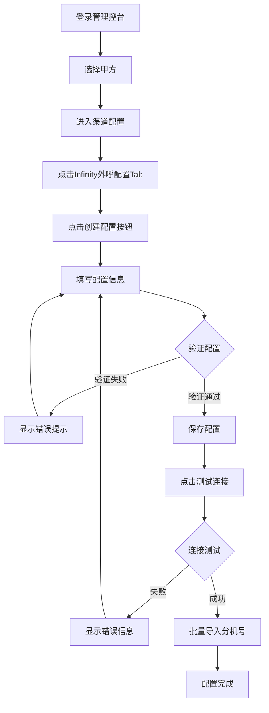
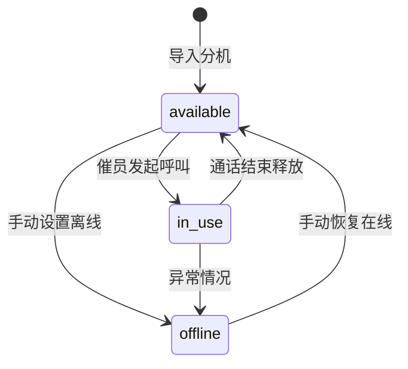
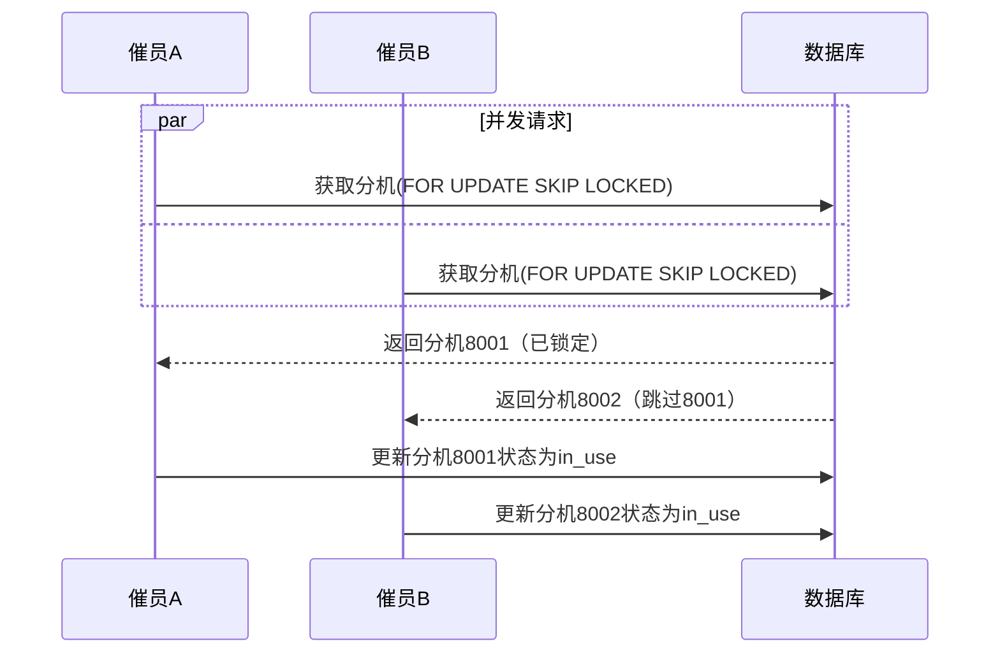
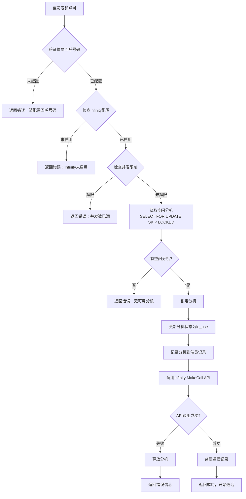
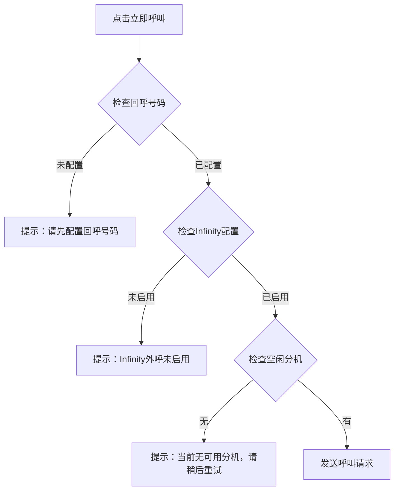
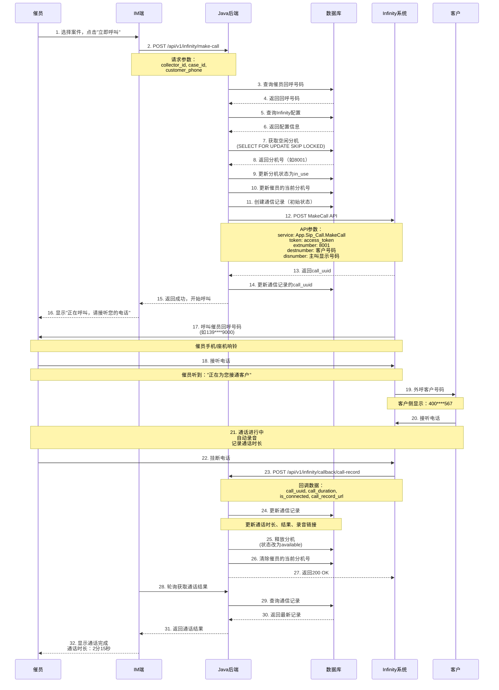
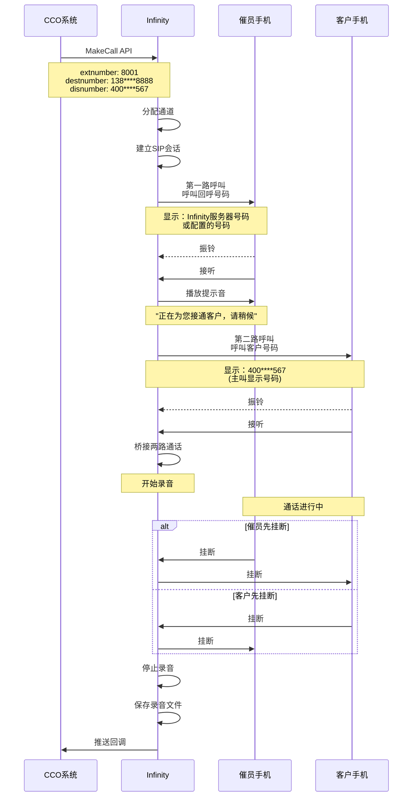

# Infinity软电话系统完整分析报告

## 变更记录

| 版本 | 日期 | 变更内容 | 变更人 |
|------|------|----------|--------|
| V1.0 | 2025-12-17 | 初始版本创建 | 大象 |

---

## 一、概述

Infinity软电话系统已成功集成到CCO催收管理系统中，支持催员通过Web界面发起外呼，无需安装本地客户端。本报告基于现有PRD文档和实施说明，全面分析Infinity软电话的后台配置、自动分配机制和催员操作行为。

**核心特性**：
- ✅ 采用动态分机分配策略，实现高效的分机资源管理
- ✅ 支持Web界面发起外呼，无需安装客户端
- ✅ 自动录音和通话记录管理
- ✅ 号码脱敏保护客户隐私
- ✅ 完整的配置管理和监控功能

---

## 二、后台配置Infinity软电话

### 2.1 配置入口与访问路径

**完整访问路径**：
```
CCO管理控台 → 账号管理 → 触达渠道管理 → Infinity外呼配置
```

**页面集成方式**：
- 作为Tab标签页集成到"甲方渠道管理"页面
- 与短信、RCS、WhatsApp、电话外呼并列
- 提供统一的配置管理界面

**页面结构**：
```
┌─────────────────────────────────────────────────────────┐
│  甲方渠道管理                         当前甲方: 百鹿企业 ▼│
├─────────────────────────────────────────────────────────┤
│  短信  │  RCS  │  WhatsApp  │  电话外呼  │  Infinity外呼配置 │
├─────────────────────────────────────────────────────────┤
│                                                           │
│           [Infinity外呼配置内容区域]                      │
│                                                           │
│  ┌─────────────────────────────────────────────────┐   │
│  │ 配置管理                                         │   │
│  │  - API地址: [http://192.168.1.100:8080]        │   │
│  │  - 访问令牌: [abcdef123456]                     │   │
│  │  - 应用ID: [CCO_SYSTEM]                         │   │
│  │  - 最大并发: [50]                                │   │
│  └─────────────────────────────────────────────────┘   │
│                                                           │
│  ┌─────────────────────────────────────────────────┐   │
│  │ 分机池管理                                       │   │
│  │  总数: 100  空闲: 85  使用中: 15  使用率: 15%   │   │
│  └─────────────────────────────────────────────────┘   │
│                                                           │
└─────────────────────────────────────────────────────────┘
```

### 2.2 核心配置字段详解

#### 必填字段

| 字段名称 | 数据类型 | 说明 | 示例值 | 验证规则 |
|---------|---------|------|--------|---------|
| API地址 | VARCHAR(500) | Infinity API服务器地址 | `http://192.168.1.100:8080` | 必须是有效的URL |
| 访问令牌 | VARCHAR(500) | Infinity API访问令牌 | `abcdef123456` | 非空，建议加密存储 |
| 应用ID | VARCHAR(100) | Infinity应用唯一标识 | `CCO_SYSTEM` | 非空，每个应用必须唯一 |
| 最大并发呼叫数 | INT | 最大同时外呼数量 | `50` | 范围: 1-100，根据购买的Infinity并发数配置 |
| 呼叫超时时间 | INT | 等待接听的超时时间(秒) | `60` | 范围: 10-300秒，默认60秒 |

#### 可选字段

| 字段名称 | 数据类型 | 说明 | 用途 | 示例值 |
|---------|---------|------|------|--------|
| 默认主叫号码 | VARCHAR(50) | 外显给客户的号码 | 客户侧看到的来电号码 | `4001234567` |
| 主叫号码池 | JSON | 可用主叫号码列表 | 多个外显号码，随机选择 | `["4001234567", "4007654321"]` |
| 回调地址 | VARCHAR(500) | 通话记录回调URL | Infinity推送通话记录 | `http://cco.example.com/api/v1/infinity/callback/call-record` |

#### 字段说明与工具提示

每个字段都配有"❓"悬浮提示，鼠标悬停即可查看详细说明：

**默认主叫号码**：
```
外显给客户看到的号码，
留空则从主叫号码池中随机选择
对应Infinity参数: disnumber (可选)
```

**主叫号码池**：
```
可用于外显的号码列表，
系统会从池中选择号码作为主叫显示
```

**回调地址**：
```
Infinity系统通话结束后，
推送通话记录的回调URL地址
需在Infinity系统管理后台配置
```

**最大并发呼叫数**：
```
系统允许的最大同时外呼数量，
超过此数量的外呼请求将被限制
根据购买的Infinity并发数配置，防止超限
```

**呼叫超时时间**：
```
发起呼叫后等待接听的超时时间，
超时后将自动挂断
```

### 2.3 配置表单操作流程

#### 首次配置流程



#### 配置变更流程

1. **编辑配置**：点击"编辑配置"按钮
2. **修改参数**：更新需要修改的字段
3. **二次确认**：系统弹出确认对话框
4. **保存生效**：配置立即生效
5. **记录日志**：自动记录操作日志

#### 测试连接功能

**测试步骤**：
1. 填写完整的配置信息
2. 点击"测试连接"按钮
3. 系统调用Infinity API进行连接测试
4. 显示测试结果（成功/失败）

**API接口**：
```
POST /api/v1/infinity/configs/test-connection
```

**请求示例**：
```json
{
  "api_url": "http://192.168.1.100:8080",
  "access_token": "abcdef123456",
  "app_id": "CCO_SYSTEM"
}
```

**响应示例**：
```json
{
  "code": 200,
  "message": "连接成功",
  "data": {
    "status": "success",
    "latency_ms": 45
  }
}
```

### 2.4 分机池管理

#### 分机池概念

分机池是Infinity外呼系统的核心资源，每个催员发起外呼时需要占用一个分机。分机池管理确保分机资源的合理分配和高效利用。

#### 批量导入分机

**导入方式**：
1. 点击"批量导入分机"按钮
2. 在弹出的文本框中输入分机号（每行一个）
3. 点击"导入"按钮
4. 系统验证并保存分机号

**导入格式**：
```
8001
8002
8003
8004
8005
```

**API接口**：
```
POST /api/v1/infinity/extensions/batch-import
```

**请求示例**：
```json
{
  "tenant_id": 1,
  "config_id": 1,
  "extension_numbers": [
    "8001",
    "8002",
    "8003",
    "8004",
    "8005"
  ]
}
```

#### 分机状态管理

**分机状态枚举**：
- `available`：空闲，可以被分配
- `in_use`：使用中，已被催员占用
- `offline`：离线，不可用

**状态转换流程**：


#### 分机池统计信息

**实时统计指标**：
```typescript
interface ExtensionStatistics {
  total: number;           // 总分机数
  available: number;       // 空闲分机数
  in_use: number;         // 使用中分机数
  offline: number;        // 离线分机数
  utilization_rate: number; // 使用率 (%)
}
```

**展示示例**：
```
┌──────────────────────────────────────────┐
│ 分机池统计                                │
├──────────────────────────────────────────┤
│ 总分机数:      100                        │
│ 空闲分机:       85                        │
│ 使用中:         15                        │
│ 离线:            0                        │
│ 使用率:        15%                        │
└──────────────────────────────────────────┘
```

#### 分机列表管理

**列表展示字段**：
- 分机号
- 状态（空闲/使用中/离线）
- 当前使用催员
- 最后使用时间
- 操作（释放/删除）

**操作功能**：
1. **手动释放**：释放被占用的分机（异常情况处理）
2. **删除分机**：从分机池中移除分机
3. **批量删除**：批量删除选中的分机

### 2.5 数据库表结构

#### infinity_call_configs 表（Infinity配置表）

```sql
CREATE TABLE `infinity_call_configs` (
  `id` BIGINT NOT NULL AUTO_INCREMENT COMMENT '主键ID',
  `tenant_id` BIGINT NOT NULL COMMENT '甲方ID（唯一）',
  `supplier_id` BIGINT DEFAULT NULL COMMENT '渠道供应商ID',
  `api_url` VARCHAR(500) NOT NULL COMMENT 'Infinity API地址',
  `access_token` VARCHAR(500) NOT NULL COMMENT '访问令牌',
  `app_id` VARCHAR(100) NOT NULL COMMENT 'Infinity应用标识',
  `default_caller_number` VARCHAR(50) DEFAULT NULL COMMENT '默认主叫号码',
  `caller_number_pool` JSON DEFAULT NULL COMMENT '主叫号码池',
  `callback_url` VARCHAR(500) DEFAULT NULL COMMENT '回调地址',
  `max_concurrent_calls` INT NOT NULL DEFAULT 50 COMMENT '最大并发数',
  `call_timeout_seconds` INT NOT NULL DEFAULT 60 COMMENT '呼叫超时时间（秒）',
  `is_active` TINYINT(1) NOT NULL DEFAULT 1 COMMENT '是否启用：0-禁用，1-启用',
  `created_at` DATETIME NOT NULL DEFAULT CURRENT_TIMESTAMP COMMENT '创建时间',
  `updated_at` DATETIME DEFAULT NULL ON UPDATE CURRENT_TIMESTAMP COMMENT '更新时间',
  `created_by` VARCHAR(50) DEFAULT NULL COMMENT '创建人',
  `updated_by` VARCHAR(50) DEFAULT NULL COMMENT '更新人',
  PRIMARY KEY (`id`),
  UNIQUE KEY `uk_tenant_id` (`tenant_id`),
  KEY `idx_is_active` (`is_active`)
) ENGINE=InnoDB DEFAULT CHARSET=utf8mb4 COMMENT='Infinity外呼配置表';
```

#### infinity_extension_pool 表（分机池表）

```sql
CREATE TABLE `infinity_extension_pool` (
  `id` BIGINT NOT NULL AUTO_INCREMENT COMMENT '主键ID',
  `tenant_id` BIGINT NOT NULL COMMENT '甲方ID',
  `config_id` BIGINT NOT NULL COMMENT '配置ID',
  `infinity_extension_number` VARCHAR(50) NOT NULL COMMENT '分机号',
  `status` ENUM('available', 'in_use', 'offline') NOT NULL DEFAULT 'available' COMMENT '状态',
  `current_collector_id` BIGINT DEFAULT NULL COMMENT '当前使用催员ID',
  `last_used_at` DATETIME DEFAULT NULL COMMENT '最后使用时间',
  `created_at` DATETIME NOT NULL DEFAULT CURRENT_TIMESTAMP COMMENT '创建时间',
  `updated_at` DATETIME DEFAULT NULL ON UPDATE CURRENT_TIMESTAMP COMMENT '更新时间',
  PRIMARY KEY (`id`),
  UNIQUE KEY `uk_tenant_extension` (`tenant_id`, `infinity_extension_number`),
  KEY `idx_status` (`status`),
  KEY `idx_tenant_id` (`tenant_id`),
  KEY `idx_current_collector_id` (`current_collector_id`)
) ENGINE=InnoDB DEFAULT CHARSET=utf8mb4 COMMENT='Infinity分机池表';
```

#### collectors 表扩展字段

```sql
-- 在现有 collectors 表中添加字段
ALTER TABLE `collectors` 
ADD COLUMN `callback_number` VARCHAR(50) DEFAULT NULL COMMENT '回呼号码（催员接听电话的号码）',
ADD COLUMN `infinity_extension_number` VARCHAR(50) DEFAULT NULL COMMENT '当前占用的Infinity分机号';
```

#### communication_records 表扩展字段

```sql
-- 在现有 communication_records 表中添加字段
ALTER TABLE `communication_records` 
ADD COLUMN `supplier_id` BIGINT DEFAULT NULL COMMENT '渠道供应商ID',
ADD COLUMN `infinity_extension_number` VARCHAR(50) DEFAULT NULL COMMENT '使用的分机号',
ADD COLUMN `call_uuid` VARCHAR(100) DEFAULT NULL COMMENT 'Infinity通话唯一标识',
ADD COLUMN `call_record_url` VARCHAR(500) DEFAULT NULL COMMENT '录音下载链接',
ADD COLUMN `custom_params` JSON DEFAULT NULL COMMENT '自定义参数';
```

### 2.6 权限控制

#### 角色权限

| 角色 | 查看配置 | 创建配置 | 编辑配置 | 删除配置 | 测试连接 | 导入分机 |
|------|---------|---------|---------|---------|---------|---------|
| SuperAdmin | ✅ | ✅ | ✅ | ✅ | ✅ | ✅ |
| TenantAdmin | ✅ | ✅ | ✅ | ❌ | ✅ | ✅ |
| 运营人员 | ✅ | ❌ | ✅ | ❌ | ✅ | ❌ |
| 催员 | ❌ | ❌ | ❌ | ❌ | ❌ | ❌ |

#### 操作审计

**记录的操作**：
- 配置创建/更新/删除
- 配置启用/禁用
- 分机导入/删除
- 测试连接

**审计日志字段**：
```typescript
interface AuditLog {
  id: number;
  operation_type: string;    // create/update/delete/status_change
  resource_type: string;      // config/extension
  resource_id: number;
  before_data: object;        // 变更前数据（JSON）
  after_data: object;         // 变更后数据（JSON）
  operator: string;           // 操作人
  operation_time: Date;       // 操作时间
  client_ip: string;          // 客户端IP
  remark: string;             // 备注
}
```

---

## 三、自动分配给催员

### 3.1 分机分配策略

系统实现了三种动态分机分配策略，可根据业务需求选择：

#### 策略一：LRU（Least Recently Used，最少使用优先）- 默认策略

**核心思想**：
- 选择最久未使用的分机
- 平衡分机使用频率
- 防止某些分机过度使用

**算法实现**：
```sql
SELECT * FROM infinity_extension_pool
WHERE tenant_id = ?
  AND status = 'available'
ORDER BY last_used_at ASC NULLS FIRST
LIMIT 1
FOR UPDATE SKIP LOCKED;
```

**优点**：
- ✅ 分机使用均衡
- ✅ 避免单个分机过热
- ✅ 延长分机使用寿命

**适用场景**：
- 长期稳定运营
- 需要平衡负载
- 分机数量充足

#### 策略二：Round Robin（轮询）

**核心思想**：
- 按顺序循环分配分机
- 确保所有分机均匀使用
- 简单高效

**算法实现**：
```java
public class RoundRobinAllocator {
    private AtomicInteger currentIndex = new AtomicInteger(0);
    
    public Extension allocate(List<Extension> availableExtensions) {
        if (availableExtensions.isEmpty()) {
            return null;
        }
        int index = currentIndex.getAndIncrement() % availableExtensions.size();
        return availableExtensions.get(index);
    }
}
```

**优点**：
- ✅ 实现简单
- ✅ 分配快速
- ✅ 完全均衡

**适用场景**：
- 需要快速分配
- 分机性能一致
- 简单场景

#### 策略三：Collector Affinity（催员亲和性）

**核心思想**：
- 优先分配催员上次使用的分机
- 提高催员使用体验
- 减少重新适应成本

**算法实现**：
```sql
-- 1. 先尝试获取催员上次使用的分机
SELECT * FROM infinity_extension_pool
WHERE tenant_id = ?
  AND status = 'available'
  AND infinity_extension_number = (
    SELECT infinity_extension_number 
    FROM collectors 
    WHERE id = ?
  )
LIMIT 1
FOR UPDATE SKIP LOCKED;

-- 2. 如果没有，则退化到LRU策略
SELECT * FROM infinity_extension_pool
WHERE tenant_id = ?
  AND status = 'available'
ORDER BY last_used_at ASC NULLS FIRST
LIMIT 1
FOR UPDATE SKIP LOCKED;
```

**优点**：
- ✅ 提升催员体验
- ✅ 减少适应时间
- ✅ 保持使用习惯

**适用场景**：
- 注重用户体验
- 催员熟悉特定分机
- 分机配置不同

### 3.2 并发安全保证

#### 数据库行锁机制

**使用 FOR UPDATE SKIP LOCKED**：

```sql
BEGIN;

-- 锁定并获取分机
SELECT * FROM infinity_extension_pool
WHERE tenant_id = 1
  AND status = 'available'
ORDER BY last_used_at ASC NULLS FIRST
LIMIT 1
FOR UPDATE SKIP LOCKED;

-- 更新分机状态
UPDATE infinity_extension_pool
SET status = 'in_use',
    current_collector_id = 123,
    last_used_at = NOW()
WHERE id = ?;

COMMIT;
```

**关键特性**：
- `FOR UPDATE`：对选中的行加排他锁
- `SKIP LOCKED`：跳过已被锁定的行，避免等待
- 事务保证：确保分配的原子性

#### 并发冲突处理

**场景**：多个催员同时发起外呼



### 3.3 分机分配完整流程

#### 流程图



#### 代码示例（Java实现）

```java
@Service
public class ExtensionAllocatorService {
    
    @Autowired
    private InfinityExtensionPoolMapper extensionMapper;
    
    @Transactional
    public Extension allocateExtension(Long tenantId, Long collectorId) {
        // 1. 获取空闲分机（使用数据库锁）
        Extension extension = extensionMapper.getAvailableExtension(
            tenantId, 
            ExtensionStatus.AVAILABLE
        );
        
        if (extension == null) {
            throw new NoAvailableExtensionException("无可用分机");
        }
        
        // 2. 更新分机状态
        extension.setStatus(ExtensionStatus.IN_USE);
        extension.setCurrentCollectorId(collectorId);
        extension.setLastUsedAt(new Date());
        extensionMapper.updateById(extension);
        
        // 3. 更新催员记录
        collectorMapper.updateExtensionNumber(
            collectorId, 
            extension.getInfinityExtensionNumber()
        );
        
        return extension;
    }
    
    @Transactional
    public void releaseExtension(Long extensionId) {
        Extension extension = extensionMapper.selectById(extensionId);
        if (extension != null) {
            extension.setStatus(ExtensionStatus.AVAILABLE);
            extension.setCurrentCollectorId(null);
            extensionMapper.updateById(extension);
        }
    }
}
```

### 3.4 催员配置要求

#### 回呼号码配置

**必需配置**：催员回呼号码（`callback_number`）

**配置路径**：
```
管理控台 → 组织架构 → 催员管理 → 编辑催员 → 回呼号码
```

**用途说明**：
- Infinity系统先呼叫此号码
- 催员接听后，系统再外呼客户
- 可以是手机号或座机号

**验证规则**：
- 必须是有效的电话号码格式
- 支持国际格式（+86 开头）
- 建议使用催员的工作手机号

**配置示例**：
```
回呼号码: 13900139000
或: +86 13900139000
```

#### 催员表字段

```sql
-- collectors 表
callback_number VARCHAR(50)              -- 回呼号码
infinity_extension_number VARCHAR(50)    -- 当前占用的分机号（自动更新）
```

---

## 四、催员接入Infinity软电话的行为

### 4.1 完整操作流程

#### 步骤1：选择案件和联系人

**操作界面**：催员IM端

**操作步骤**：
1. 在案件列表中选择需要外呼的案件
2. 查看案件详情，获取客户联系方式
3. 选择客户的主要联系电话

**前置条件**：
- 催员已登录IM系统
- 案件已分配给该催员
- 客户有有效的联系电话

#### 步骤2：发起外呼

**操作界面**：IM面板 → 电话外呼Tab

**操作步骤**：
1. 点击"立即呼叫"按钮
2. 系统自动验证：
   - 催员回呼号码是否配置
   - Infinity配置是否启用
   - 是否有空闲分机
   - 是否超过并发限制

**前端代码示例**：
```typescript
// IMPanel.vue
async function makeCall() {
  try {
    // 显示呼叫中状态
    isCallingRef.value = true;
    callStatusRef.value = '正在呼叫...';
    
    // 调用外呼API
    const response = await infinityApi.makeCall({
      collector_id: currentCollector.id,
      case_id: currentCase.id,
      customer_phone: selectedPhone.value,
      caller_number: null // 使用配置的默认号码
    });
    
    // 保存call_uuid
    callUuidRef.value = response.data.call_uuid;
    callStatusRef.value = '等待接听...';
    
  } catch (error) {
    isCallingRef.value = false;
    ElMessage.error(error.message || '发起呼叫失败');
  }
}
```

**验证流程**：


#### 步骤3：接听催员侧电话

**呼叫流程**：
1. Infinity系统首先呼叫催员的回呼号码
2. 催员手机或座机响铃
3. 催员接听电话

**等待时间**：
- 响铃超时时间：配置的 `call_timeout_seconds`（默认60秒）
- 如果催员未接听，通话失败，分机自动释放

**用户提示**：
```
┌──────────────────────────────┐
│ 外呼进行中                    │
├──────────────────────────────┤
│ 请接听您的回呼电话            │
│ 回呼号码: 139****9000        │
│                              │
│ [等待中...]                  │
└──────────────────────────────┘
```

#### 步骤4：自动外呼客户

**触发条件**：催员接听回呼电话后

**呼叫动作**：
- Infinity系统自动外呼客户号码
- 客户侧显示主叫号码（配置的外显号码，如400电话）
- 催员听到外呼提示音

**客户侧体验**：
```
来电显示: 4001234567 (主叫显示号码)
```

**催员侧提示音**：
```
"正在为您接通客户，请稍候..."
```

#### 步骤5：通话进行

**通话功能**：
- ✅ 双方正常通话
- ✅ 系统自动录音
- ✅ 实时记录通话时长
- ✅ 通话质量监控

**通话界面**：
```
┌──────────────────────────────┐
│ 通话进行中                    │
├──────────────────────────────┤
│ 客户: 李先生                  │
│ 号码: 138****8888            │
│                              │
│ ⏱ 通话时长: 00:02:15         │
│                              │
│ 🔴 录音中                    │
│                              │
│ [挂断] [静音] [转接]         │
└──────────────────────────────┘
```

**录音说明**：
- 自动开启录音
- 录音文件保存在Infinity服务器
- 通话结束后通过回调推送录音链接

#### 步骤6：通话结束

**结束方式**：
- 催员挂断
- 客户挂断
- 超时自动挂断

**自动处理**：
1. Infinity推送通话记录到回调地址
2. 系统自动更新通信记录：
   - 通话时长
   - 通话结果（接通/未接通）
   - 录音链接
3. 释放分机（状态改为`available`）
4. 清除催员的当前分机号

**回调数据**：
```json
{
  "call_uuid": "CALL_20251217143025_12345",
  "call_duration": 135,
  "is_connected": true,
  "call_record_url": "http://infinity.example.com/recordings/20251217/xxx.mp3",
  "contact_result": "connected",
  "remark": "通话正常结束",
  "custom_params": {
    "collector_id": "456",
    "case_id": "12345"
  }
}
```

### 4.2 异常情况处理

#### 情况1：催员未接听回呼电话

**现象**：
- 催员回呼号码响铃
- 催员未在超时时间内接听

**处理**：
1. 通话失败
2. 释放分机
3. 创建失败记录
4. 提示催员："您未接听回呼电话，通话已取消"

#### 情况2：客户未接听

**现象**：
- 催员已接听回呼电话
- 客户号码响铃但未接听

**处理**：
1. 记录为"未接通"
2. 释放分机
3. 保存通话记录（通话时长为0）
4. 允许催员再次呼叫

#### 情况3：通话中断

**现象**：
- 通话进行中突然中断
- 网络异常导致掉线

**处理**：
1. Infinity检测到通话中断
2. 推送回调（标记为异常结束）
3. 释放分机
4. 记录实际通话时长

#### 情况4：无可用分机

**现象**：
- 所有分机都在使用中
- 并发数已达到上限

**处理**：
1. 返回错误提示
2. 建议催员稍后重试
3. 不占用分机资源

**提示消息**：
```
当前外呼繁忙，暂无可用分机。
请稍后重试或联系管理员增加分机数量。
```

### 4.3 通话记录管理

#### 通话记录数据结构

```typescript
interface CommunicationRecord {
  id: number;
  collector_id: number;           // 催员ID
  case_id: number;               // 案件ID
  customer_phone: string;        // 客户号码（脱敏）
  caller_number: string;         // 主叫显示号码
  extension_number: string;      // 使用的分机号
  call_uuid: string;            // Infinity通话唯一标识
  call_duration: number;         // 通话时长（秒）
  is_connected: boolean;         // 是否接通
  contact_result: string;        // 联系结果
  call_record_url: string;       // 录音下载链接
  custom_params: object;         // 自定义参数
  created_at: Date;             // 创建时间
  updated_at: Date;             // 更新时间
}
```

#### 通话记录查询

**查询界面**：管理控台 → 通话记录

**查询条件**：
- 时间范围
- 催员姓名
- 客户号码
- 通话时长
- 接通状态

**列表展示**：
- 呼叫时间
- 催员姓名
- 客户号码（脱敏）
- 通话时长
- 接通状态
- 录音播放

#### 录音管理

**录音存储**：
- 存储位置：Infinity服务器
- 文件格式：MP3
- 保存时长：根据业务需求配置（如90天）

**录音访问**：
1. 点击"播放录音"按钮
2. 系统获取录音URL
3. 在线播放或下载

**权限控制**：
- 催员：只能听自己的录音
- 组长：可以听本组催员的录音
- 管理员：可以听所有录音

---

## 五、完整外呼流程时序图

### 5.1 标准外呼流程



### 5.2 Infinity双向呼叫详细流程



---

## 六、号码脱敏与数据隐私

### 6.1 号码脱敏规则

#### 脱敏策略

**客户号码脱敏**：
- 规则：显示前3位和后4位，中间用*代替
- 示例：`13812345678` → `138****5678`
- 适用场景：
  - 案件列表
  - 通话记录列表
  - 催员工作台
  - 导出Excel

**催员回呼号码脱敏**：
- 规则：显示前3位和后4位，中间用*代替
- 示例：`13900139000` → `139****9000`
- 适用场景：
  - 外呼提示界面
  - 通话记录查询
  - 审计日志

#### 脱敏实现

**前端实现**：
```typescript
// utils/phone.ts
export function maskPhone(phone: string): string {
  if (!phone || phone.length < 11) {
    return phone;
  }
  return phone.replace(/(\d{3})\d{4}(\d{4})/, '$1****$2');
}

// 使用示例
const maskedPhone = maskPhone('13812345678');
console.log(maskedPhone); // 输出: 138****5678
```

**后端实现（Java）**：
```java
public class PhoneUtil {
    public static String maskPhone(String phone) {
        if (phone == null || phone.length() < 11) {
            return phone;
        }
        return phone.replaceAll("(\\d{3})\\d{4}(\\d{4})", "$1****$2");
    }
}
```

#### 完整号码访问权限

**权限级别**：
- SuperAdmin：可以查看完整号码
- TenantAdmin：可以查看本甲方的完整号码
- 组长：可以查看本组案件的完整号码
- 催员：只能在外呼时使用完整号码（不直接显示）

**实现方式**：
```typescript
interface PhoneDisplay {
  masked: string;      // 脱敏号码（始终返回）
  full?: string;       // 完整号码（仅授权用户）
  canViewFull: boolean; // 是否有权限查看完整号码
}
```

### 6.2 敏感数据加密

#### 访问令牌加密

**加密算法**：AES-256

**存储方式**：
```java
@Service
public class EncryptionService {
    
    @Value("${encryption.secret-key}")
    private String secretKey;
    
    public String encrypt(String plainText) {
        // AES-256 加密实现
        // ...
    }
    
    public String decrypt(String encryptedText) {
        // AES-256 解密实现
        // ...
    }
}
```

**数据库存储**：
```sql
-- infinity_call_configs 表
access_token VARCHAR(500)  -- 存储加密后的令牌
```

**前端展示**：
```
访问令牌: abcd************6789  [显示完整]
```

#### 录音文件访问控制

**访问策略**：
1. 录音URL包含签名参数
2. URL有效期限制（如24小时）
3. IP白名单限制
4. 用户权限验证

**URL格式**：
```
http://infinity.example.com/recordings/20251217/xxx.mp3
  ?signature=abc123
  &expires=1702828800
  &user_id=123
```

### 6.3 数据隐私合规

#### GDPR合规

**数据最小化**：
- 只收集必要的通话数据
- 定期清理过期录音
- 匿名化统计数据

**用户权利**：
- 数据访问权：客户可以要求查看通话记录
- 数据删除权：客户可以要求删除录音
- 数据纠正权：客户可以更正联系方式

#### 数据保留策略

**通话记录**：
- 保留期限：90天（可配置）
- 超期处理：自动归档或删除

**录音文件**：
- 保留期限：90天（可配置）
- 超期处理：自动删除
- 重要录音：可标记为永久保留

**配置示例**：
```json
{
  "data_retention": {
    "call_records_days": 90,
    "recording_files_days": 90,
    "important_recordings_permanent": true
  }
}
```

#### 审计日志

**记录内容**：
- 谁（操作人）
- 什么时候（操作时间）
- 做了什么（操作类型）
- 操作结果（成功/失败）

**日志示例**：
```json
{
  "timestamp": "2025-12-17T14:30:25",
  "operator": "admin@example.com",
  "action": "view_full_phone",
  "resource": "customer_phone",
  "resource_id": "13812345678",
  "ip_address": "192.168.1.100",
  "result": "success"
}
```

---

## 七、API接口文档

### 7.1 Infinity配置管理API

#### 创建配置

**接口**：`POST /api/v1/infinity/configs`

**请求参数**：
```json
{
  "tenant_id": 1,
  "api_url": "http://192.168.1.100:8080",
  "access_token": "abcdef123456",
  "app_id": "CCO_SYSTEM",
  "default_caller_number": "4001234567",
  "caller_number_pool": ["4001234567", "4007654321"],
  "callback_url": "http://cco.example.com/api/v1/infinity/callback/call-record",
  "max_concurrent_calls": 50,
  "call_timeout_seconds": 60,
  "is_active": true
}
```

**响应示例**：
```json
{
  "code": 200,
  "message": "配置创建成功",
  "data": {
    "config_id": 1
  }
}
```

#### 获取配置

**接口**：`GET /api/v1/infinity/configs/{tenant_id}`

**响应示例**：
```json
{
  "code": 200,
  "message": "success",
  "data": {
    "id": 1,
    "tenant_id": 1,
    "api_url": "http://192.168.1.100:8080",
    "access_token": "abcd************6789",
    "app_id": "CCO_SYSTEM",
    "default_caller_number": "4001234567",
    "caller_number_pool": ["4001234567", "4007654321"],
    "max_concurrent_calls": 50,
    "call_timeout_seconds": 60,
    "is_active": true,
    "created_at": "2025-12-01 10:00:00",
    "updated_at": "2025-12-17 15:30:00"
  }
}
```

### 7.2 分机池管理API

#### 批量导入分机

**接口**：`POST /api/v1/infinity/extensions/batch-import`

**请求参数**：
```json
{
  "tenant_id": 1,
  "config_id": 1,
  "extension_numbers": ["8001", "8002", "8003", "8004", "8005"]
}
```

**响应示例**：
```json
{
  "code": 200,
  "message": "导入成功",
  "data": {
    "total": 5,
    "success": 5,
    "failed": 0
  }
}
```

#### 获取分机池统计

**接口**：`GET /api/v1/infinity/extensions/statistics/{tenant_id}`

**响应示例**：
```json
{
  "code": 200,
  "message": "success",
  "data": {
    "total": 100,
    "available": 85,
    "in_use": 15,
    "offline": 0,
    "utilization_rate": 15.0
  }
}
```

### 7.3 外呼核心API

#### 发起外呼

**接口**：`POST /api/v1/infinity/make-call`

**请求参数**：
```json
{
  "collector_id": 123,
  "case_id": 12345,
  "customer_phone": "13812345678",
  "caller_number": null
}
```

**响应示例**：
```json
{
  "code": 200,
  "message": "呼叫发起成功",
  "data": {
    "call_uuid": "CALL_20251217143025_12345",
    "extension_number": "8001",
    "estimated_wait_time": 10
  }
}
```

#### 通话记录回调

**接口**：`POST /api/v1/infinity/callback/call-record`

**请求参数**（Infinity推送）：
```json
{
  "call_uuid": "CALL_20251217143025_12345",
  "call_duration": 135,
  "is_connected": true,
  "call_record_url": "http://infinity.example.com/recordings/20251217/xxx.mp3",
  "contact_result": "connected",
  "remark": "通话正常结束",
  "custom_params": {
    "collector_id": "123",
    "case_id": "12345"
  }
}
```

**响应示例**：
```json
{
  "code": 200,
  "message": "回调处理成功"
}
```

---

## 八、测试与验证

### 8.1 功能测试清单

#### 后台配置测试

- [ ] 管理员可以访问Infinity配置页面
- [ ] 可以创建新的Infinity配置
- [ ] 可以编辑现有配置
- [ ] 可以启用/禁用配置
- [ ] 测试连接功能正常
- [ ] API地址验证正确
- [ ] 访问令牌脱敏显示
- [ ] 配置变更需要二次确认
- [ ] 配置变更记录操作日志

#### 分机池管理测试

- [ ] 可以批量导入分机号
- [ ] 分机号重复时提示错误
- [ ] 可以查看分机池统计信息
- [ ] 分机状态实时更新
- [ ] 可以手动释放分机
- [ ] 可以删除分机
- [ ] 分机列表支持分页
- [ ] 分机列表支持筛选

#### 催员配置测试

- [ ] 可以配置催员回呼号码
- [ ] 回呼号码格式验证正确
- [ ] 回呼号码必填验证
- [ ] 回呼号码支持国际格式

#### 外呼功能测试

- [ ] 催员可以发起外呼
- [ ] 未配置回呼号码时提示错误
- [ ] 无空闲分机时提示错误
- [ ] 分机自动分配成功
- [ ] 分机状态正确更新
- [ ] 催员回呼电话响铃
- [ ] 催员接听后自动外呼客户
- [ ] 客户侧显示正确的主叫号码
- [ ] 通话可以正常进行
- [ ] 通话可以正常挂断

#### 通话记录测试

- [ ] 通话记录自动创建
- [ ] 通话时长正确记录
- [ ] 通话结果正确标记
- [ ] 录音链接正确保存
- [ ] 回调数据正确处理
- [ ] 分机自动释放
- [ ] 客户号码正确脱敏
- [ ] 可以查询通话记录
- [ ] 可以播放录音
- [ ] 录音访问权限正确

### 8.2 性能测试

#### 并发测试

**测试场景**：多个催员同时发起外呼

**测试步骤**：
1. 准备100个催员账号
2. 配置100个分机
3. 同时发起100个外呼请求
4. 验证分机分配无冲突
5. 验证所有通话正常进行

**预期结果**：
- 分机分配无重复
- 分机分配速度 < 100ms
- 无数据库死锁
- 无并发异常

#### 压力测试

**测试指标**：
- QPS: 100 (峰值)
- 响应时间: 平均 < 500ms, P99 < 1s
- 并发用户数: 100
- 分机池大小: 100

**测试工具**：JMeter或Locust

**测试场景**：
```
并发线程: 100
Ramp-up时间: 10秒
持续时间: 5分钟
请求类型: 发起外呼
```

### 8.3 安全测试

#### 权限测试

- [ ] 未授权用户无法访问配置页面
- [ ] 催员无法查看其他催员的通话记录
- [ ] 组长只能查看本组催员的通话记录
- [ ] 访问令牌正确加密存储
- [ ] API接口需要身份验证
- [ ] 敏感操作记录审计日志

#### 数据安全测试

- [ ] 客户号码正确脱敏
- [ ] 访问令牌不在日志中明文显示
- [ ] 录音文件需要权限访问
- [ ] SQL注入防护有效
- [ ] XSS攻击防护有效

---

## 九、监控与告警

### 9.1 关键监控指标

#### 业务指标

| 指标名称 | 说明 | 采集频率 | 告警阈值 |
|---------|------|---------|---------|
| 外呼成功率 | 成功接通的呼叫比例 | 5分钟 | < 80% |
| 平均通话时长 | 平均每通电话的时长 | 1小时 | - |
| 分机使用率 | 使用中分机数/总分机数 | 1分钟 | > 90% |
| 并发呼叫数 | 当前同时进行的呼叫数 | 实时 | - |
| 外呼失败率 | 外呼失败的比例 | 5分钟 | > 10% |

#### 技术指标

| 指标名称 | 说明 | 采集频率 | 告警阈值 |
|---------|------|---------|---------|
| API响应时间 | 接口平均响应时长 | 1分钟 | P99 > 1s |
| API错误率 | 接口错误请求比例 | 1分钟 | > 5% |
| 分机分配时长 | 分配分机的耗时 | 实时 | > 100ms |
| 数据库连接数 | 数据库连接池使用数 | 1分钟 | > 80% |
| 回调延迟 | 通话结束到收到回调的时间 | 实时 | > 10s |

### 9.2 告警规则

#### 外呼失败率告警

**告警条件**：
- 5分钟内外呼失败率 > 10%
- 持续3次采集周期

**告警级别**：P2（重要）

**告警动作**：
- 发送企业微信通知
- 发送短信给运维人员
- 记录告警日志

#### 分机资源不足告警

**告警条件**：
- 分机使用率 > 90%
- 持续5分钟

**告警级别**：P3（一般）

**告警动作**：
- 发送企业微信通知
- 建议增加分机数量

#### API性能告警

**告警条件**：
- API P99响应时长 > 2s
- 持续10分钟

**告警级别**：P2（重要）

**告警动作**：
- 发送企业微信通知
- 自动扩容（如果支持）

---

## 十、总结与建议

### 10.1 已实现功能

✅ **核心功能完整**：
- 后台配置管理界面完善
- 分机池管理功能完整
- 动态分机分配策略实现
- 催员外呼流程顺畅
- 通话记录自动管理
- 号码脱敏保护隐私

✅ **技术架构合理**：
- 前后端分离架构
- 数据库设计规范
- 并发安全保证
- API接口完善

✅ **用户体验良好**：
- 界面统一整合
- 操作流程简单
- 错误提示友好
- 实时反馈清晰

### 10.2 待优化功能

⏳ **功能增强**：
1. 案件详情页外呼按钮集成
2. 催员工作台批量外呼
3. 通话记录详情页（录音播放器优化）
4. 通话质量监控
5. AI外呼机器人集成

⏳ **安全增强**：
1. 访问令牌自动轮换
2. 回调请求签名验证
3. IP白名单限制
4. 录音文件加密存储

⏳ **性能优化**：
1. 分机分配算法优化
2. 数据库索引优化
3. 缓存策略优化
4. 批量操作优化

### 10.3 运维建议

1. **定期检查**：
   - 每日检查分机池使用情况
   - 每周检查外呼成功率
   - 每月检查录音文件存储空间

2. **容量规划**：
   - 根据业务增长预测分机需求
   - 提前扩容分机数量
   - 合理配置并发限制

3. **数据备份**：
   - 定期备份配置数据
   - 定期备份通话记录
   - 重要录音永久保留

4. **应急预案**：
   - Infinity服务不可用时的降级方案
   - 数据库异常时的恢复流程
   - 分机资源耗尽时的处理方案

---

## 附录

### A. 参考文档

1. [触达渠道管理-Infinity外呼配置PRD](PRD需求文档/CCO管理控台/触达渠道管理/触达渠道管理-Infinity外呼配置PRD.md)
2. [Infinity外呼系统集成完成报告](说明文档/功能说明/Infinity外呼系统集成完成报告.md)
3. [Infinity配置字段优化说明](说明文档/功能说明/Infinity配置字段优化说明.md)
4. [Infinity外呼配置菜单集成说明](说明文档/功能说明/Infinity外呼配置菜单集成说明.md)
5. [Infinity号段配置说明](说明文档/功能说明/Infinity号段配置说明.md)

### B. 相关文件清单

#### 前端文件
- `frontend/src/views/channel-config/InfinityCallConfig.vue`
- `frontend/src/views/channel-config/InfinityCallConfigContent.vue`
- `frontend/src/components/IMPanel.vue`
- `frontend/src/types/infinity.ts`
- `frontend/src/api/infinity.ts`
- `frontend/src/utils/timezone.ts`

#### 后端文件（待实现）
- `backend-java/src/main/java/com/cco/controller/InfinityCallController.java`
- `backend-java/src/main/java/com/cco/controller/InfinityConfigController.java`
- `backend-java/src/main/java/com/cco/service/ExtensionAllocatorService.java`
- `backend-java/src/main/java/com/cco/model/entity/InfinityCallConfig.java`
- `backend-java/src/main/java/com/cco/model/entity/InfinityExtensionPool.java`

### C. 常见问题FAQ

**Q1: 为什么需要配置催员回呼号码？**
A: Infinity采用双向呼叫模式，先呼叫催员，催员接听后再外呼客户。回呼号码用于接听催员侧的电话。

**Q2: 分机使用率过高怎么办？**
A: 建议增加分机数量或调整外呼策略，避免集中时段外呼。

**Q3: 客户投诉收到过多电话怎么办？**
A: 检查外呼限制配置，确保单日外呼次数不超过3次，外呼时间在8:00-21:00之间。

**Q4: 录音文件过大占用存储怎么办？**
A: 配置自动清理策略，90天后自动删除，重要录音可手动标记永久保留。

**Q5: 如何保证客户隐私？**
A: 系统对所有客户号码进行脱敏显示，录音文件有访问权限控制，符合GDPR规范。

---

**报告完成时间**：2025-12-17  
**报告版本**：V1.0  
**分析人**：大象


