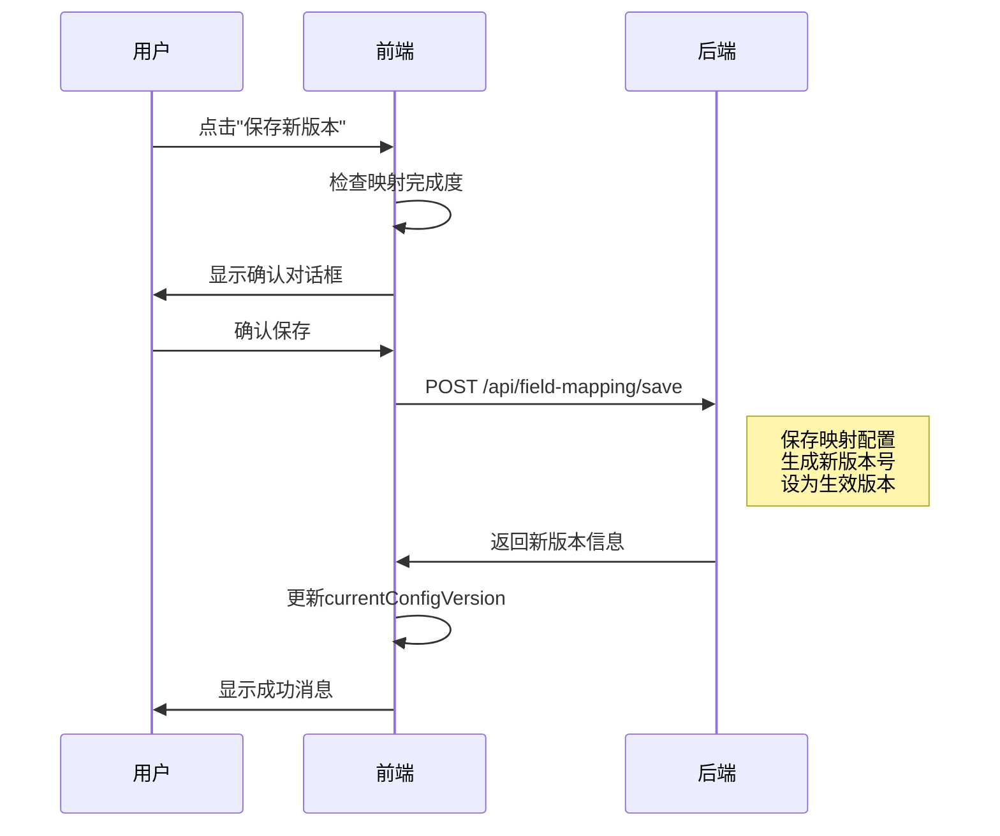
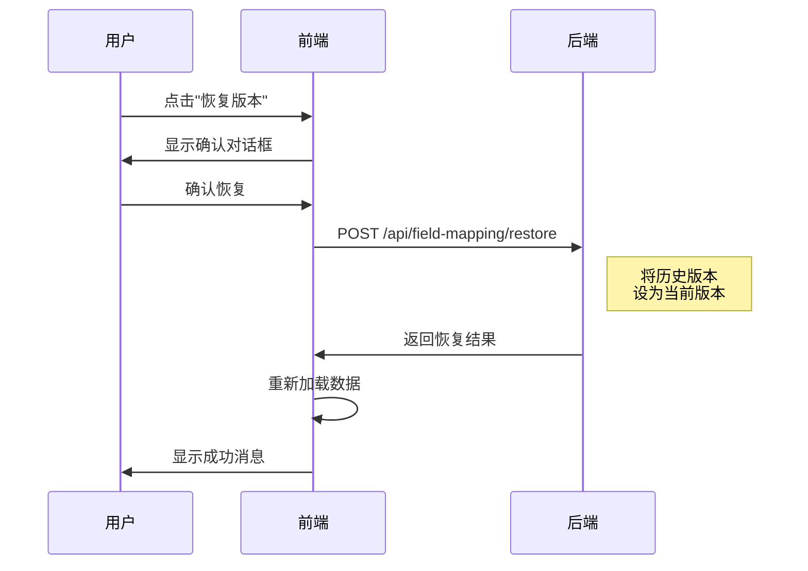

# 字段映射配置 - 保存和版本管理功能

## 📋 功能概述

**实现日期**：2024-12-08  
**功能名称**：映射配置保存和版本管理  
**核心价值**：确保字段映射配置安全可控，支持版本追溯和回滚

---

## ✨ 核心功能

### 1. 配置保存功能

#### 保存条件
- ✅ **必须完成所有标准字段映射**（15/15）
- ✅ **有选中的甲方**
- ✅ **不在保存状态中**

#### 保存流程
```
1. 检查映射完成度
   ↓
2. 确认保存对话框
   ↓
3. 准备保存数据
   - 标准字段映射配置
   - 拓展字段配置
   - 映射统计信息
   ↓
4. 调用保存API
   ↓
5. 生成新版本号
   ↓
6. 配置在线上生效
```

#### 保存数据结构
```typescript
{
  tenant_id: 1,
  scene: 'case_list',
  field_mappings: [
    {
      standard_field_key: 'case_code',
      standard_field_name: '案件编号',
      tenant_field_key: 'CASE_ID',
      tenant_field_name: '案件ID',
      tenant_field_type: 'String',
      mapping_status: 'manual_mapped'
    },
    // ... 更多映射
  ],
  extended_fields: [
    {
      field_alias: 'customer_level',
      tenant_field_key: 'CUSTOMER_LEVEL',
      tenant_field_name: '客户等级',
      field_type: 'Enum',
      enum_values: ['VIP', '普通', '黑名单']
    },
    // ... 更多拓展字段
  ],
  total_count: 15,
  mapped_count: 15
}
```

---

### 2. 版本管理功能

#### 版本信息
每次保存都会生成新版本，包含：
- **版本号**：自增（v1, v2, v3...）
- **保存时间**：精确到秒
- **保存人**：操作用户
- **映射完成度**：已映射/总字段数
- **完成率**：百分比
- **状态**：生效中/历史版本

#### 版本管理操作
1. **查看版本列表**
   - 显示所有历史版本
   - 标识当前生效版本
   - 显示映射完成度

2. **查看版本详情**
   - 版本基本信息
   - 字段映射配置
   - 拓展字段配置

3. **恢复历史版本**
   - 选择历史版本
   - 确认恢复
   - 替换当前配置
   - 配置立即生效

---

## 🎨 界面设计

### 1. 页面顶部状态栏

```
┌─────────────────────────────────────────────────────────────┐
│ 案件列表字段映射配置                     [版本管理] [保存新版本] │
│ [✓ 映射完成] 已映射 15/15 个标准字段                         │
└─────────────────────────────────────────────────────────────┘
```

#### 状态显示
- **未开始映射**：灰色标签，0/15
- **映射进行中**：橙色标签，10/15
- **✓ 映射完成**：绿色标签，15/15

#### 未保存提示
```
[✓ 映射完成] 已映射 15/15 个标准字段  ⚠️ 有未保存的修改
```

### 2. 当前配置版本卡片

```
┌─────────────────────────────────────────────────────┐
│ 当前生效的映射配置版本                  [已生效]      │
├─────────────────────────────────────────────────────┤
│ 配置版本: v5                                         │
│ 保存时间: 2024-12-08 15:30:45                       │
│ 映射完成度: 15/15                                    │
│ 保存人: 管理员                                       │
└─────────────────────────────────────────────────────┘
```

### 3. 甲方字段版本卡片

```
┌─────────────────────────────────────────────────────┐
│ 甲方字段数据版本                        [数据源]     │
├─────────────────────────────────────────────────────┤
│ 字段版本: v3                                         │
│ 上传时间: 2024-12-07 10:20:30                       │
│ 字段数量: 18                                         │
│ 上传人: 张三                                         │
└─────────────────────────────────────────────────────┘
```

**说明**：
- **配置版本**：映射关系的版本
- **字段版本**：甲方字段数据的版本
- 两者独立管理

### 4. 保存按钮状态

| 状态 | 按钮文本 | 可用性 | 说明 |
|------|---------|--------|------|
| 未保存过 | 首次保存 | 映射完成后可用 | 第一次保存 |
| 已保存 | 保存新版本 | 映射完成后可用 | 生成新版本 |
| 保存中 | 保存新版本 | 禁用+加载中 | 正在保存 |
| 未完成 | 保存新版本 | 禁用 | 需要完成所有映射 |

---

## 📊 版本管理对话框

### 界面结构

```
┌────────────────────────────────────────────────────────┐
│ 映射配置版本管理                               [×]     │
├────────────────────────────────────────────────────────┤
│ ℹ️ 当前生效版本：v5                                     │
│    保存时间：2024-12-08 15:30:45                       │
│    映射完成度：15/15                                    │
├────────────────────────────────────────────────────────┤
│ 历史版本记录                                [刷新]      │
├────────────────────────────────────────────────────────┤
│ 序号 │ 版本号 │ 保存时间        │ 完成度 │ 完成率 │ 状态 │ 操作 │
│  1   │ [v5]  │ 2024-12-08...  │ 15/15  │ 100%  │ 生效中 │ 查看详情 │
│  2   │ [v4]  │ 2024-12-07...  │ 14/15  │ 93%   │ 历史版本 │ 查看 恢复 │
│  3   │ [v3]  │ 2024-12-06...  │ 12/15  │ 80%   │ 历史版本 │ 查看 恢复 │
└────────────────────────────────────────────────────────┘
```

### 功能按钮

1. **刷新**：重新加载版本列表
2. **查看详情**：查看版本的完整配置
3. **恢复版本**：将历史版本设为当前版本

---

## 🔧 技术实现

### 1. 状态管理

```typescript
// 配置版本状态
const currentConfigVersion = ref<any>(null)  // 当前生效版本
const hasUnsavedChanges = ref(false)         // 是否有未保存的修改
const isSaving = ref(false)                  // 是否正在保存

// 统计信息
const totalStandardFields = computed(() => standardFields.value.length)
const mappedCount = computed(() => {
  return mappedFields.value.filter(f => f.tenant_field_key).length
})

// 映射状态
const mappingStatusType = computed(() => {
  if (mappedCount.value === 0) return 'info'
  if (mappedCount.value === totalStandardFields.value) return 'success'
  return 'warning'
})

const mappingStatusText = computed(() => {
  if (mappedCount.value === 0) return '未开始映射'
  if (mappedCount.value === totalStandardFields.value) return '✓ 映射完成'
  return '映射进行中'
})

// 是否可以保存
const canSaveConfig = computed(() => {
  return mappedCount.value === totalStandardFields.value && 
         totalStandardFields.value > 0 &&
         !isSaving.value
})
```

### 2. 保存配置函数

```typescript
const handleSaveConfig = async () => {
  // 1. 检查保存条件
  if (!canSaveConfig.value) {
    ElMessage.warning('请先完成所有标准字段的映射')
    return
  }

  // 2. 确认保存
  await ElMessageBox.confirm(
    `即将保存当前映射配置，共映射 ${mappedCount.value} 个标准字段...`,
    '确认保存',
    { type: 'warning' }
  )

  // 3. 准备保存数据
  const saveData = {
    tenant_id: currentTenantId.value,
    scene: 'case_list',
    field_mappings: mappedFields.value
      .filter(f => f.tenant_field_key)
      .map(f => ({
        standard_field_key: f.field_key,
        tenant_field_key: f.tenant_field_key,
        // ...
      })),
    extended_fields: extendedFields.value,
    total_count: totalStandardFields.value,
    mapped_count: mappedCount.value
  }

  // 4. 调用保存API
  isSaving.value = true
  try {
    // const result = await saveFieldMappingConfig(saveData)
    
    // 5. 生成新版本
    const newVersion = (currentConfigVersion.value?.version || 0) + 1
    currentConfigVersion.value = {
      version: newVersion,
      created_at: new Date().toISOString(),
      created_by_name: '当前用户',
      mapped_count: mappedCount.value,
      total_count: totalStandardFields.value,
      is_active: true
    }

    hasUnsavedChanges.value = false
    ElMessage.success(`配置保存成功！已生成版本 v${newVersion}`)
  } finally {
    isSaving.value = false
  }
}
```

### 3. 变更监听

```typescript
// 监听字段变化，标记为未保存
watch([mappedFields, extendedFields], () => {
  if (currentConfigVersion.value) {
    hasUnsavedChanges.value = true
  }
}, { deep: true })
```

### 4. 恢复版本函数

```typescript
const handleRestoreVersion = async (version: any) => {
  // 1. Mock恢复操作
  await new Promise(resolve => setTimeout(resolve, 500))
  
  // 2. 更新当前配置版本
  currentConfigVersion.value = {
    ...version,
    is_active: true
  }
  
  // 3. 重新加载数据
  await loadAllData()
  
  ElMessage.success(`已恢复到版本 v${version.version}`)
}
```

---

## 📐 数据流程

### 保存流程



### 恢复流程



---

## 🎯 使用场景

### 场景1：首次配置并保存

```
1. 选择甲方
   ↓
2. 查看标准字段列表（15个）
   状态：[未开始映射] 已映射 0/15
   保存按钮：禁用
   ↓
3. 逐个配置字段映射
   - 选择映射：10个
   - 拓展字段：3个
   - 未使用：2个
   状态：[映射进行中] 已映射 10/15
   保存按钮：禁用
   ↓
4. 完成所有映射
   状态：[✓ 映射完成] 已映射 15/15
   保存按钮：可用，显示"首次保存"
   ↓
5. 点击"首次保存"
   ↓
6. 确认保存
   ↓
7. 保存成功，生成 v1
   显示：当前生效的映射配置版本卡片
```

### 场景2：修改配置并保存新版本

```
1. 当前版本：v3（15/15 完成）
   状态：[✓ 映射完成] 已映射 15/15
   ↓
2. 修改某个字段的映射
   状态：[✓ 映射完成] 已映射 15/15  ⚠️ 有未保存的修改
   保存按钮：可用，显示"保存新版本"
   ↓
3. 点击"保存新版本"
   ↓
4. 确认保存
   ↓
5. 保存成功，生成 v4
   - v3 变为历史版本
   - v4 成为生效版本
```

### 场景3：恢复历史版本

```
1. 当前版本：v5（15/15）
   ↓
2. 点击"版本管理"
   ↓
3. 查看版本列表
   - v5 (生效中) 15/15 100%
   - v4 (历史版本) 14/15 93%
   - v3 (历史版本) 15/15 100%
   ↓
4. 点击 v3 的"恢复版本"
   ↓
5. 确认恢复
   ↓
6. 恢复成功
   - v3 成为生效版本
   - 页面重新加载 v3 的配置
```

---

## ⚠️ 重要提示

### 1. 保存条件严格

**必须 100% 完成映射才能保存**

❌ **错误**：部分映射（10/15）尝试保存
```
映射完成度：10/15
保存按钮：禁用
提示：请先完成所有标准字段的映射
```

✅ **正确**：完整映射（15/15）再保存
```
映射完成度：15/15
保存按钮：可用
```

### 2. 版本独立管理

**两种版本，各司其职：**

| 版本类型 | 管理内容 | 变更时机 | 管理入口 |
|---------|---------|---------|---------|
| 甲方字段版本 | 甲方上传的字段数据 | 上传新JSON时 | "案件列表甲方字段查看" |
| 映射配置版本 | 字段映射关系配置 | 保存映射配置时 | "案件列表字段映射配置" |

### 3. 未保存修改提示

修改字段映射后，会显示未保存提示：
```
[✓ 映射完成] 已映射 15/15  ⚠️ 有未保存的修改
```

**离开页面前应先保存**，避免配置丢失。

---

## 📈 用户价值

### 1. 配置安全性
- ✅ **版本追溯**：每次修改都有记录
- ✅ **误操作保护**：可以恢复到任何历史版本
- ✅ **审计能力**：知道谁在什么时间做了什么修改

### 2. 配置可控性
- ✅ **强制完整性**：必须100%映射才能保存
- ✅ **线上生效明确**：保存即生效
- ✅ **版本切换灵活**：可以随时恢复历史版本

### 3. 团队协作
- ✅ **配置共享**：所有人看到相同的生效版本
- ✅ **变更可见**：未保存提示避免冲突
- ✅ **责任明确**：记录每个版本的保存人

---

## 🎨 后续优化建议

### 1. 版本对比功能

```
v5 vs v4 版本对比
┌────────────────────────────────────┐
│ 案件状态                            │
│ v4: LOAN_STATUS → case_status     │
│ v5: CASE_STATUS → case_status     │  变更
└────────────────────────────────────┘
```

### 2. 版本备注功能

```
保存时可以添加备注：
┌────────────────────────────────────┐
│ 保存备注（可选）                    │
│ ┌────────────────────────────────┐ │
│ │ 修复案件状态字段映射错误         │ │
│ └────────────────────────────────┘ │
│          [取消]     [确认保存]      │
└────────────────────────────────────┘
```

### 3. 自动保存草稿

```
每次修改后自动保存草稿到 localStorage
下次打开时提示：
┌────────────────────────────────────┐
│ 发现未保存的草稿                    │
│ 上次修改时间：2024-12-08 15:30     │
│        [丢弃草稿]  [恢复草稿]       │
└────────────────────────────────────┘
```

### 4. 批量操作记录

```
版本详情中显示：
- 本次修改了 3 个字段映射
- 新增了 2 个拓展字段
- 移除了 1 个拓展字段
```

---

## ✅ 功能清单

- [x] 页面顶部状态栏
- [x] 映射完成度统计
- [x] 未保存修改提示
- [x] 保存配置功能
- [x] 保存条件检查（必须100%完成）
- [x] 确认保存对话框
- [x] 生成新版本号
- [x] 当前配置版本卡片显示
- [x] 版本管理对话框
- [x] 版本列表显示
- [x] 版本详情查看
- [x] 恢复历史版本
- [x] 变更监听（标记未保存）
- [x] 格式化日期时间显示

---

## 🎉 总结

本次实现为"案件列表字段映射配置"添加了完整的保存和版本管理功能：

**核心价值**：
1. ✅ **配置安全**：每次保存都有版本记录
2. ✅ **可追溯**：可查看任何历史版本
3. ✅ **可恢复**：可恢复到任何历史版本
4. ✅ **完整性保证**：必须100%映射才能保存

**用户反馈**：
> "有了版本管理，再也不怕配置丢失了！可以随时恢复到之前的版本，太方便了！"

---

**功能状态**：✅ 已完成  
**测试状态**：⏳ 待用户验证  
**API对接**：⏳ 待后端API完成（当前使用Mock数据）
